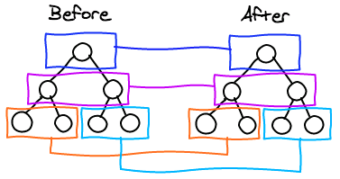
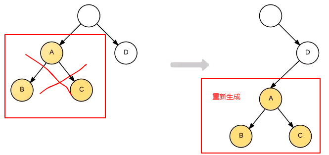
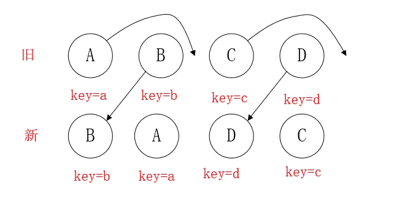
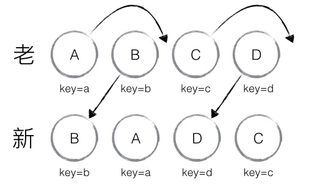
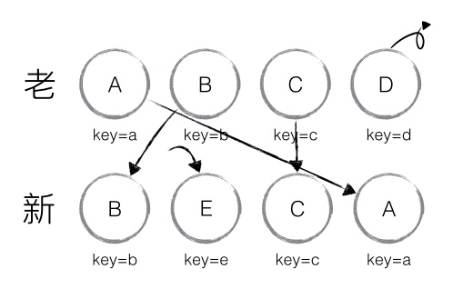
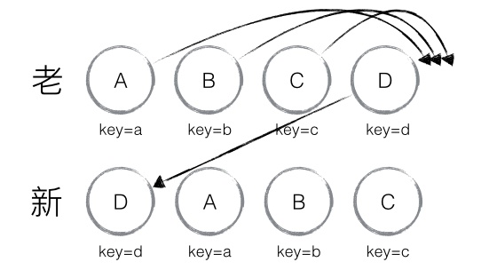
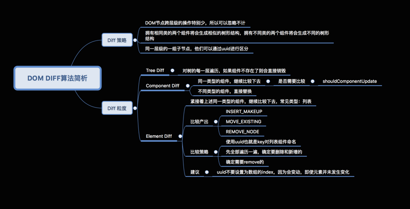

## React diff原理

传统diff算法通过循环递归对节点进行依次对比，效率低下，算法复杂度达到 O(n^3)，其中 n 是树中节点的总数。

react却利用其特殊的diff算法做到了O(n^3)到O(n)的飞跃性的提升，而完成这一壮举的法宝就是下面这三条看似简单的diff策略：

- Web UI中DOM节点跨层级的移动操作特别少，可以忽略不计。（tree diff）
- 拥有相同类的两个组件将会生成相似的树形结构，拥有不同类的两个组件将会生成不同的树形结构。（component diff）
- 对于同一层级的一组子节点，它们可以通过唯一 id 进行区分。（element diff）

## tree diff （同层比较，不同直接删）

基于策略一，React 对树的算法进行了简洁明了的优化，即对树进行分层比较，两棵树只会对同一层次的节点进行比较。



既然 DOM 节点跨层级的移动操作少到可以忽略不计，针对这一现象，React只会对相同层级的 DOM 节点进行比较，即同一个父节点下的所有子节点。当发现节点已经不存在时，则该节点及其子节点会被完全删除掉，不会用于进一步的比较。这样只需要对树进行一次遍历，便能完成整个 DOM 树的比较。

策略一的前提是Web UI中DOM节点跨层级的移动操作特别少，但还是有，由于 React 只会简单地考虑同层级节点的位置变换，而对于不 同层级的节点，只有创建和删除操作，所以如果是跨层级移动就是把之前的销毁，然后在重新创建，这非常消耗性能。




## component diff （同类比较，不同直接删）


- 如果是同一类型的组件，按照原策略继续比较 Virtual DOM 树即可。
- 如果不是，则将该组件判断为 dirty component，从而替换整个组件下的所有子节点。
- 对于同一类型的组件，可通过props的浅比较shouldComponentUpdate()来判断是否变了。但是如果调用了forceUpdate方法，shouldComponentUpdate则失效。


## element diff （加key判断是否需要删除）

当节点处于同一层级时，diff 提供了 3 种节点操作，分别为 INSERT_MARKUP (插入)、MOVE_EXISTING (移动)和 REMOVE_NODE (删除)。

- INSERT_MARKUP :新的组件类型不在旧集合里，即全新的节点，需要对新节点执行插入操作。
- MOVE_EXISTING :旧集合中有新组件类型，且 element 是可更新的类型，- generateComponentChildren 已调用receiveComponent ，这种情况下 - prevChild=nextChild ，就需要做移动操作，可以复用以前的 DOM 节点。
- REMOVE_NODE :旧组件类型，在新集合里也有，但对应的 element 不同则不能直接复用和更新，需要执行删除操作，或者旧组件不在新集合里的，也需要执行删除操作。


如果两颗树的同一层仅仅是位置不对，但diff的时候是对比的相同位置的节点，就会认为节点不同而选择删除并创建新的。

React针对这一现象提出了一种优化策略：允许开发者对同一层级的同组子节点，添加唯一 key 进行区分。

通过key可以准确地发现新旧集合中的节点都是相同的节点，因此无需进行节点删除和创建，只需要将旧集合中节点的位置进行移动，更新为新集合中节点的位置。



**注意**：在开发过程中，尽量减少类似将最后一个节点移动到列表首部的操作。当节点数量过大或更新操作过于频繁时，这在一定程度上会影响React的渲染性能。

## ChildrenDiff的源码


通过key可以准确地发现新旧集合中的节点都是相同的节点，因此无需进行节点删除和创建，只需要将旧集合中节点的位置进行移动，更新为新集合中节点的位置
源码：
```
_updateChildren: function(nextNestedChildrenElements, transaction, context) {
  var prevChildren = this._renderedChildren;
  var nextChildren = this._reconcilerUpdateChildren(
    prevChildren, nextNestedChildrenElements, transaction, context
  );
  if (!nextChildren && !prevChildren) {
    return;
  }
  var name;
  var lastIndex = 0;
  var nextIndex = 0;
  // 首先对新集合的节点进行循环遍历
  for (name in nextChildren) {
    // 通过唯一 key 可以判断新老集合中是否存在相同的节点
    if (!nextChildren.hasOwnProperty(name)) {
      continue;
    }
    var prevChild = prevChildren && prevChildren[name];
    var nextChild = nextChildren[name];
    if (prevChild === nextChild) {
      // 移动节点
      this.moveChild(prevChild, nextIndex, lastIndex);
      lastIndex = Math.max(prevChild._mountIndex, lastIndex);
      prevChild._mountIndex = nextIndex;
    } else {
      if (prevChild) {
        lastIndex = Math.max(prevChild._mountIndex, lastIndex);
        // 删除节点
        this._unmountChild(prevChild);
      }
      // 初始化并创建节点
      this._mountChildAtIndex(
        nextChild, nextIndex, transaction, context
      );
    }
    nextIndex++;
  }
  for (name in prevChildren) {
    if (prevChildren.hasOwnProperty(name) &&
        !(nextChildren && nextChildren.hasOwnProperty(name))) {
      this._unmountChild(prevChildren[name]);
    }
  }
  this._renderedChildren = nextChildren;
},
// 移动节点
moveChild: function(child, toIndex, lastIndex) {
  if (child._mountIndex < lastIndex) {
    this.prepareToManageChildren();
    enqueueMove(this, child._mountIndex, toIndex);
  }
},
// 创建节点
createChild: function(child, mountImage) {
  this.prepareToManageChildren();
  enqueueInsertMarkup(this, mountImage, child._mountIndex);
},
// 删除节点
removeChild: function(child) {
  this.prepareToManageChildren();
  enqueueRemove(this, child._mountIndex);
},

_unmountChild: function(child) {
  this.removeChild(child);
  child._mountIndex = null;
},

_mountChildAtIndex: function(
  child,
  index,
  transaction,
  context) {
  var mountImage = ReactReconciler.mountComponent(
    child,
    transaction,
    this,
    this._nativeContainerInfo,
    context
  );
  child._mountIndex = index;
  this.createChild(child, mountImage);
},
```

### 根据源码分析Key的比对策略

**lastIndex表示访问过的新节点在老集合中最右的位置（即最大的位置）**
- 如果新集合中当前访问的节点比 lastIndex 大，说明当前访问节点在老集合中就比上一个节点位置靠后，则该节点不会影响其他节点的位置，因此不用添加到差异队列中，即不执行移动操作
- 只有当访问的节点比 lastIndex 小时，才需要进行移动操作。
- 比如下图前面的AB怎么玩都不用触发CD的移动，你一眼就能看出来，但的告诉React才行，所以标记一个lastIndex来告诉React后面的需不需动

### 第一种没有删除的现象



column0 | column1 | column2 | column3 | column4 |
------- | ------- | ------- | ------- | ------- | 
nextIndex | 节点 | mountIndex | lastIndex | 操作 | 
0 | B | 1 | 0 | mountIndex(1)>lastIndex(0),lastIndex=mountIndex
1 | A | 0 | 1 | mountIndex(0) < lastIndex(1),节点A移动至index(1)的位置
2 | D | 3 | 1 | mountIndex(3)> lastIndex(1),lastIndex=mountIndex
3 | C | 2 | 3 | mountIndex(2)< lastIndex(3),节点C移动至index(2)的位置

0位置处分析：
- 从新集合中取得 B，判断老集合中存在相同节点 B，通过对比节点位置判断是否进行移动操作
- B 在老集合中的位置 B._mountIndex = 1，此时 lastIndex = 0，不满足 child._mountIndex < lastIndex 的条件，因此不对 B 进行移动操作；
- 更新 lastIndex = Math.max(prevChild._mountIndex, lastIndex)，其中 prevChild._mountIndex 表示 B 在老集合中的位置，则 lastIndex ＝ 1
- 并将 B 的位置更新为新集合中的位置prevChild._mountIndex = nextIndex
- 此时新集合中 B._mountIndex = 0，nextIndex++ 进入下一个节点的判断。
  
1位置处分析：
- 从新集合中取得 A，判断老集合中存在相同节点 A，通过对比节点位置判断是否进行移动操作
- A 在老集合中的位置 A._mountIndex = 0，此时 lastIndex = 1，满足 child._mountIndex < lastIndex的条件，因此对 A 进行移动操作enqueueMove(this, child._mountIndex, toIndex)
- 其中 toIndex 其实就是 nextIndex，表示 A 需要移动到的位置；更新 lastIndex = Math.max(prevChild._mountIndex, lastIndex)
- lastIndex ＝ 1，并将 A 的位置更新为新集合中的位置 prevChild._mountIndex = nextIndex，此时新集合中A._mountIndex = 1，nextIndex++ 进入下一个节点的判断。

然后往后循环就行了，其终极目标就是用最少的移动来完成节点的更新

### 第二种有删除节点的情况


index | 节点 | oldIndex | maxIndex | 操作
------- | ------- | ------- | ------- | -------
0 | B | 1 | 0 | oldIndex(1)>maxIndex(0)，maxIndex=oldIndex
1 | E | - | 1 | oldIndex不存在，添加节点E至index(1)的位置
2 | C | 2 | 1 | 不操作
3 | A | 0 | 3 | oldIndex(0)< maxIndex(3),节点A移动至index(3)的位置

最后还需要对旧集合进行循环遍历，找出新集合中没有的节点，此时发现存在这样的节点D，因此删除节点D，到此 diff 操作全部完成。


* oldIndex存在
  * 当oldIndex>maxIndex时，将oldIndex的值赋值给maxIndex
  * 当oldIndex=maxIndex时，不操作
  * 当oldIndex< maxIndex时，将当前节点移动到index的位置
* oldIndex不存在
 * 新增当前节点至index的位置

### 加上Key值的Diff算法还是有缺陷

从末尾插入头部就会造成整层的移动，所以React官方也表明避免往头部插入数据


## 总结

  