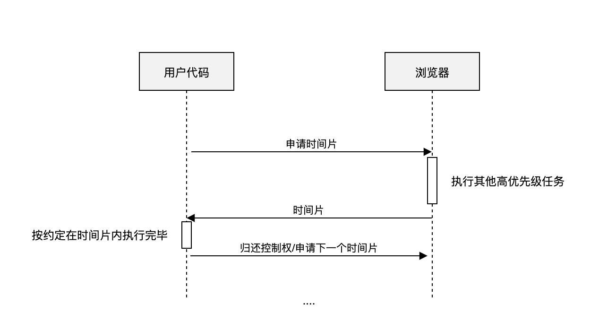
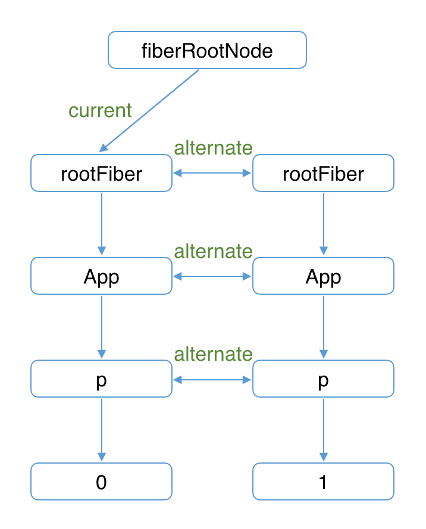
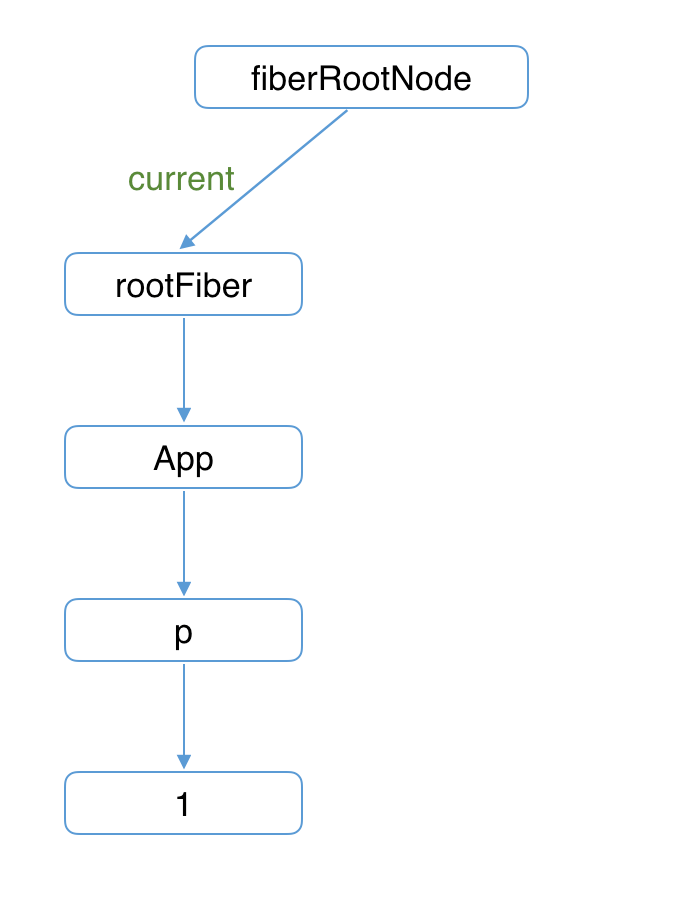

## 什么是React Fiber 
Fiber 是 React 16 中新的协调引擎。它的主要目的是使 Virtual DOM 可以进行增量式渲染

## React 的核心思想

内存中维护一颗虚拟DOM树，数据变化时（setState），自动更新虚拟 DOM，得到一颗新树，然后 Diff 新老虚拟 DOM 树，找到有变化的部分，得到一个 Change(Patch)，将这个 Patch 加入队列，最终批量更新这些 Patch 到 DOM 中。

##  React 的工作过程

当我们通过render() 和 setState() 进行组件渲染和更新的时候，React 主要有两个阶段：

- 调和阶段(Reconciler)：官方解释。React 会自顶向下通过递归（15版本），遍历新数据生成新的 Virtual DOM，然后通过 Diff 算法，找到需要变更的元素(Patch)，放到更新队列里面去。

- 渲染阶段(Renderer)：遍历更新队列，通过调用宿主环境的API，实际更新渲染对应元素。宿主环境，比如 DOM、Native、WebGL 等。(如浏览器渲染出页面)

协调器要做的工作是计算出一棵树的哪些部分发生了变化；然后渲染器使用这些信息来更新渲染app。


## 何为 Fiber

一种流程控制原语
Fiber 也称协程、或者纤程
协程和线程并不一样，协程本身是没有并发或者并行能力的（需要配合线程），它只是一种控制流程的让出机制。

React Fiber 的思想和协程的概念是契合的: React 渲染的过程可以被中断，可以将控制权交回浏览器，让位给高优先级的任务，浏览器空闲后再恢复渲染。

以 React 通过Fiber 架构，让自己的Reconcilation 过程变成可被中断。 '适时'地让出执行权，除了可以让浏览器及时地响应用户的交互

## 为什么需要Fiber(fiber reconciler)

在setState后，react会立即开始reconciliation过程，从父节点（Virtual DOM）开始遍历，以找出不同。将所有的Virtual DOM遍历完成后，reconciler才能给出当前需要修改真实DOM的信息，并传递给renderer渲染进程，进行渲染，然后屏幕上才会显示此次更新内容。

react在进行组件渲染时，从setState开始到渲染完成整个过程（reconciliation）是同步的（“一气呵成”）。如果需要渲染的组件比较庞大，js执行会占据主线程时间较长，因此任何交互、布局、渲染都会停止，给用户的感觉就是页面被卡住了。会导致页面响应度变差，使得react在动画、手势等应用中效果比较差。

为了解决这个问题，react团队经过两年的工作，重写了react中核心算法——reconciliation。并在v16版本中发布了这个新的特性。为了区别之前和之后的reconciler，通常将之前的reconciler称为stack reconciler（像函数的调用过程。父组件里调子组件，可以类比为函数的递归），重写后的称为fiber reconciler，简称为Fiber。


## Fiber的关键特性如下：

- 任务分解的意义 解决上面的问题

- 增量渲染（把渲染任务拆分成块，匀到多帧）

- 更新时能够暂停，终止，复用渲染任务

- 给不同类型的更新赋予优先级

- 并发方面新的基础能力

## Fiber是如何拆分渲染任务的

### 谁可以拆分

把渲染/更新过程(fiber reconciler)分为2个阶段（diff + patch）：

1.diff ~ render/reconciliation(初次次渲染是render)
2.patch ~ commit

diff的实际工作是对比prevInstance和nextInstance的状态，找出差异及其对应的DOM change。diff本质上是一些计算（遍历、比较），是可拆分的（算一半待会儿接着算）

patch阶段把本次更新中的所有DOM change应用到DOM树，是一连串的DOM操作。一般场景下，DOM更新的耗时比起diff及生命周期函数耗时不算什么，拆分的意义不很大

结论：render/reconciliation阶段的工作（diff）可以拆分

### 怎么拆分

按组件拆太粗，显然对大组件不太公平。按工序拆太细，任务太多，频繁调度不划算。

**所以Fiber采用的的拆分单位是fiber（fiber tree上的一个节点），实际上就是按虚拟DOM节点拆，因为fiber tree是根据vDOM tree构造出来的，树结构一模一样，只是节点携带的信息有差异**

所以，实际上是vDOM node粒度的拆分（以fiber为工作单元），每个组件实例和每个DOM节点抽象表示的实例都是一个工作单元。工作循环中，每次处理一个fiber，处理完可以中断/挂起整个工作循环(完成后确认否还有时间继续下一个任务，存在时继续，不存在下一个任务时自己挂起，主线程不忙的时候再继续。)

## Fiber的合作式调度任务

### 合作式调度

’任务‘之间的界限很模糊，没有上下文，所以不具备中断/恢复的条件。二是没有抢占的机制，我们无法中断一个正在执行的程序。

所以我们只能采用类似协程这样控制权让出机制。它有更一个专业的名词：合作式调度(Cooperative Scheduling), 相对应的有抢占式调度(Preemptive Scheduling)
这是一种’契约‘调度，要求我们的程序和浏览器紧密结合，互相信任。

于是可以把渲染更新过程拆分成多个子任务，每次只做一小部分，由浏览器给我们分配执行时间片(通过requestIdleCallback实现, 下文会介绍)，我们要按照约定在这个时间内执行完毕，做完看是否还有剩余时间，如果有继续下一个任务；如果没有，挂起当前任务，将时间控制权交给主线程，等主线程不忙的时候在继续执行。





### 如何调度任务

#### 工作循环

>感觉工作循环可以理解为一个渲染帧，或者说是一次事件循环

工作循环是基本的任务调度机制，工作循环中每次处理一个任务（工作单元），处理完毕有一次喘息的机会：看时间用完了没（idleDeadline.timeRemaining()），没用完的话继续处理下一个任务，用完了就结束，把时间控制权还给主线程，等下一次requestIdleCallback回调再接着做

（不考虑突发事件的）正常调度是由工作循环来完成的，基本规则是：每个工作单元结束检查是否还有时间做下一个，没时间了就先“挂起”

#### 优先级机制

用来处理突发事件与优化次序，例如：

- 到commit阶段了，提高优先级

- 高优任务做一半出错了，给降一下优先级

- 抽空关注一下低优任务，别给饿死了

- 如果对应DOM节点此刻不可见，给降到最低优先级

这些策略用来动态调整任务调度，是工作循环的辅助机制，最先做最重要的事情


## Fiber Reconciler 的两个阶段 

因为更新过程可能被打断，提交diff的过程又不能打断，所以Reconciler一个更新过程被分为两个阶段： reconciliation(render phase) and commit phase.
- （可中断）reconciliation/render phase，生成 Fiber 树，得出需要更新的节点信息。这一步是一个渐进的过程，可以被打断。
- （不可中断）commit phase，将需要更新的节点一次过批量更新，这个过程不能被打断。

reconciliation/render phase:

- [UNSAFE_]componentWillMount（弃用）
- [UNSAFE_]componentWillReceiveProps（弃用）
- getDerivedStateFromProps
- shouldComponentUpdate
- [UNSAFE_]componentWillUpdate（弃用）
- render

commit phase:

- getSnapshotBeforeUpdate
- componentDidMount
- componentDidUpdate
- componentWillUnmount

**React为什么要废弃 componentWillMount 和 componentWillReceiveProps方法而改为静态方法 getDerivedStateFromProps 的原因:**

在Reconciliation Phase的任务都是可以被打断的，三个will钩子也是在这个阶段执行，如果这个时候又一个高优先级的任务来了，就会打断Reconciliation Phase先去执行高优先级任务，然后再回来，React这边并不会具体保存你具体执行了什么钩子，肯定是重新在走一遍。所以这些钩子可能会被多次执行，如果多次打断的话

**为什么commit阶段不能打断:**
commit阶段要执行componentDidMount这种react完全失控的副作用，如果能打断多次执行就会重复调用多次副作用，就全完了


## Fiber Tree 和 WorkInProgress Tree

### Fiber Tree

React 在 render 第一次渲染时，会通过 React.createElement 创建一颗 Element 树，可以称之为 Virtual DOM Tree，由于要记录上下文信息，加入了 Fiber，每一个 Element 会对应一个 Fiber Node，将 Fiber Node 链接起来的结构成为 Fiber Tree。它反映了用于渲染 UI 的应用程序的状态。这棵树通常被称为 current 树（当前树，记录当前页面的状态），然后会循环利用，不会重复建立。

在后续的更新过程中（setState），每次重新渲染都会重新创建 Element, 但是 Fiber 不会，Fiber 只会使用对应的 Element 中的数据来更新自己必要的属性，
Fiber Tree 一个重要的特点是链表结构，将递归遍历转化为循环遍历，然后配合 requestIdleCallback API, 实现任务拆分、中断与恢复。

这个链接的结构是怎么构成的呢，这就要主要到之前 Fiber Node 的节点的这几个字段：
```
// 单链表树结构
{
   return: Fiber | null, // 指向父节点
   child: Fiber | null,// 指向自己的第一个子节点
   sibling: Fiber | null,// 指向自己的兄弟结构，兄弟节点的return指向同一个父节点
}
```


### WorkInProgress Tree

它反映了要刷新到屏幕的未来状态。现有的fiber tree构造出新的fiber tree（workInProgress tree）。

**React运行时存在3种实例**

```
DOM 真实DOM节点
-------
Instances 根据Elements创建的，对组件及DOM节点的抽象表示，Virtual DOM tree维护了组件状态以及组件与DOM树的关系。
-------
Elements 描述UI长什么样子（type, props）
```


在首次渲染过程中构建出vDOM tree，后续需要更新时（setState()），diff vDOM tree得到DOM change，并把DOM change应用（patch）到DOM树


Fiber把渲染/更新过程（递归diff）拆分成一系列小任务，每次检查树上的一小部分，做完看是否还有时间继续下一个任务，有的话继续，没有的话把自己挂起，主线程不忙的时候再继续

增量更新需要更多的上下文信息，之前的vDOM tree显然难以满足，所以扩展出了fiber tree（即Fiber上下文的vDOM tree），更新过程就是根据输入数据以及现有的fiber tree构造出新的fiber tree（workInProgress tree）。

因此，Instance层新增了这些实例：
```
DOM
    真实DOM节点
-------
//Instances
effect
    每个workInProgress tree节点上都有一个effect list
    用来存放diff结果
    当前节点更新完毕会向上merge effect list（queue收集diff结果）
- - - -
workInProgress
    workInProgress tree是reconcile过程中从fiber tree建立的当前进度快照，用于断点恢复
- - - -
fiber
    fiber tree与vDOM tree类似，用来描述增量更新所需的上下文信息
-------
Elements
    描述UI长什么样子（type, props）
```
### 双缓冲技术（double buffering）

>https://react.iamkasong.com/process/doubleBuffer.html#mount%E6%97%B6

当我们用canvas绘制动画，每一帧绘制前都会调用ctx.clearRect清除上一帧的画面。
如果当前帧画面计算量比较大，导致清除上一帧画面到绘制当前帧画面之间有较长间隙，就会出现白屏。为了解决这个问题，我们可以在内存中绘制当前帧动画，绘制完毕后直接用当前帧替换上一帧画面，由于省去了两帧替换间的计算时间，不会出现从白屏到出现画面的闪烁情况。

这种在内存中构建并直接替换的技术叫做双缓存。

React使用“双缓存”来完成Fiber树的构建与替换——对应着DOM树的创建与更新。

并不是直接在旧的Fiber tree上更新，当setState后，通过新的Elements结构从旧的Fiber tree上构建出WorkInProgress Tree（这就是diff的过程），当WorkInProgress Tree 构造完毕，得到的就是新的 Fiber Tree（也收集了effects），然后喜新厌旧（把 current 指针指向WorkInProgress Tree，丢掉旧的 Fiber Tree）就好了。
这样做的好处：

- 能够复用内部对象（fiber）
- 节省内存分配、GC的时间开销
- 就算运行中有错误，也不会影响 View 上的数据

current Fiber树中的Fiber节点被称为current fiber，workInProgress Fiber树中的Fiber节点被称为workInProgress fiber，他们通过alternate属性连接。
```
currentFiber.alternate === workInProgressFiber;
workInProgressFiber.alternate === currentFiber;
```

React应用的根节点通过current指针在不同Fiber树的rootFiber间切换来实现Fiber树的切换。

当workInProgress Fiber树构建完成交给Renderer渲染在页面上后，应用根节点的current指针指向workInProgress Fiber树，此时workInProgress Fiber树就变为current Fiber树。


#### 首屏渲染的情况

在构建workInProgress Fiber树时会尝试复用current Fiber树中已有的Fiber节点内的属性，在首屏渲染时只有rootFiber存在对应的current fiber（即rootFiber.alternate）。


已构建完的workInProgress Fiber树在commit阶段渲染到页面。此时DOM更新为右侧树对应的样子。fiberRootNode的current指针指向workInProgress Fiber树使其变为current Fiber 树。


#### 进入更新流程情况

接下来我们点击p节点触发状态改变，这会开启一次新的render阶段并构建一棵新的workInProgress Fiber 树。



workInProgress Fiber 树在render阶段完成构建后进入commit阶段渲染到页面上。渲染完毕后，workInProgress Fiber 树变为current Fiber 树。




## reconciliation 阶段

reconciliation阶段简单来说就是找到需要更新的工作，通过 Diff Fiber Tree 找出要做的更新工作，这是一个js计算过程，计算结果可以被缓存，计算过程可以被打断，也可以恢复执行

以fiber tree为蓝本，把每个fiber作为一个工作单元，自顶向下逐节点构造workInProgress tree **（构建中的新fiber tree）**

**具体过程如下（以组件节点为例）：**

1. 如果当前节点不需要更新，直接把子节点clone过来，跳到5；要更新的话打个tag

2. 更新当前节点状态（props, state, context等）

3. 调用shouldComponentUpdate()，false的话，跳到5

4. 调用render()获得新的子节点，并为子节点创建fiber（创建过程会尽量复用现有fiber，子节点增删也发生在这里）

5. 如果没有产生child fiber，该工作单元结束，把effect list归并到return，并把当前节点的sibling作为下一个工作单元；否则把child作为下一个工作单元

6. 如果没有剩余可用时间了，等到下一次主线程空闲时才开始下一个工作单元；否则，立即开始做

7. 如果没有下一个工作单元了（回到了workInProgress tree的根节点），第1阶段结束，进入pendingCommit状态

实际上是1-6的工作循环，7是出口，工作循环每次只做一件事，做完看要不要喘口气。工作循环结束时，workInProgress tree的根节点身上的effect list(记录了包括DOM change在内的所有side effect)就是收集到的所有side effect（因为每做完一个都向上归并）

**所以，构建workInProgress tree的过程就是diff的过程，通过requestIdleCallback（react重写的）来调度执行一组任务，每完成一个任务后回来看看有没有插队的（更紧急的），每完成一组任务，把时间控制权交还给主线程，直到下一次requestIdleCallback回调再继续构建workInProgress tree**


## 总结

上面说了一大堆总结一下就是：React 渲染的过程可以被中断，可以将控制权交回浏览器，让位给高优先级的任务，浏览器闲后再恢复渲染,如何来实现就需要浏览器的requestIdleCallback
这个API，下篇说明渲染帧与requestIdleCallback。


