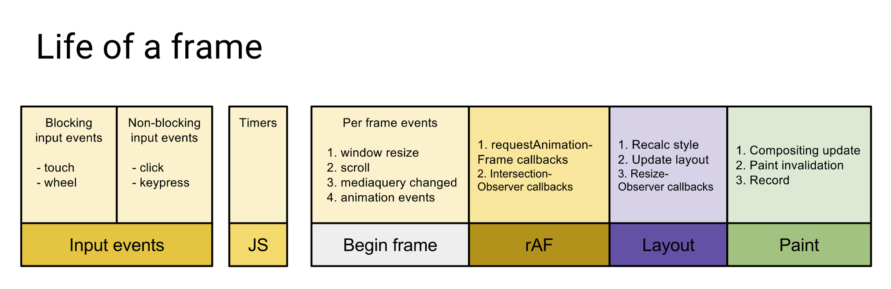
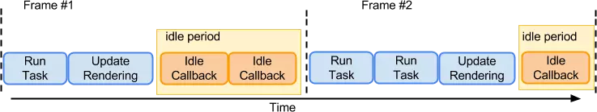

## 浏览器的渲染帧 


### 渲染帧的流程

下面是浏览器一帧需要执行的任务：包含了用户的交互、js的执行、以及requestAnimationFrame的调用，布局计算（Layout）以及页面的重绘,合成（Composite）等工作

比较完整的：


简化版的：


- JavaScript：JavaScript实现动画效果，DOM元素操作等。
- Style（计算样式）：确定每个DOM元素应该应用什么CSS规则。
- Layout（布局）：计算每个DOM元素在最终屏幕上显示的大小和位置。由于web页面的元素布局是相对的，所以其中任意一个元素的位置发生变化，都会联动的引起其他元素发生变化，这个过程叫reflow。
- Paint（绘制）：在多个层上绘制DOM元素的的文字、颜色、图像、边框和阴影等。
- Composite（渲染层合并）：按照合理的顺序合并图层然后显示到屏幕上。

### 耗时 JS 会造成丢帧

在事件循环的一次 Tick 中， 如果要执行的逻辑太多会一直阻塞下一个 Tick，所有异步过程都会被阻塞。 一个流畅的页面中，JavaScript 引擎中的执行队列可能是这样的：

```
执行 JS -> 空闲 -> 绘制（16ms）-> 执行 JS -> 空闲 -> 绘制（32ms）-> ...
```

如果在某个时刻有太多 JavaScript 要执行，就会丢掉一次帧的绘制：

```
执行很多 JS...（20ms）-> 空闲 -> 绘制（32ms）-> ...

```
这就是js的执行会阻塞页面的渲染

### 避免交错读写样式

```
// 触发一次 Layout
var h = div.clientHeight
div.style.height = h + 20
// 再次触发 Layout
var w = div.clientWidth
div.style.width = w + 20
```
每次 Layout 触发都会阻塞当前脚本。 如果把交错的读写分隔开，就可以减少触发 Layout 的次数：
```
// 触发一次 Layout
var h = div.clientHeight
var w = div.clientWidth
div.style.height = h + 20
div.style.width = w + 20
```

### 合并重绘

广泛使用的屏幕都有固定的刷新率（比如最新的一般在 60Hz）， 在两次硬件刷新之间浏览器进行两次重绘是没有意义的只会消耗性能。 浏览器会利用这个间隔 16ms（1000ms/60）适当地对绘制进行节流

### 浏览器渲染总结

- 一个渲染帧内 commit 的多次 DOM 改动会被合并渲染；
- 耗时 JS 会造成丢帧；
- 渲染帧间隔为 16ms 左右；
- 避免耗时脚本、交错读写样式以保证流畅的渲染。


##  requestIdelCallbackAPI

scheduler会根据当前主线程的使用情况去处理这次update。为了实现这种特性，使用了requestIdelCallbackAPI类似的思想，在浏览器空闲的时候申请调度。react会加上pollyfill，实现类似功能。通过requestAnimationFrame来实现。


## requestAnimationFrame

window.requestAnimationFrame() 告诉浏览器——你希望执行一个函数，并且要求浏览器在下次重绘之前调用指定的回调函数。该方法需要传入一个回调函数作为参数，该回调函数会在浏览器下一次重绘之前执行

通过requestAnimationFrame调用回调函数引起的页面重绘或回流的时间间隔和显示器的刷新时间间隔相同。所以 requestAnimationFrame 不需要像setTimeout那样传递时间间隔，而是浏览器通过系统获取并使用显示器刷新频率

显示器有固定的刷新频率60Hz ，也就是说，每秒最多只能重绘 60 次，requestAnimationFrame 的基本思想让页面重绘的频率与这个刷新频率保持同步
比如显示器屏幕刷新率为 60Hz，使用requestAnimationFrame API，那么回调函数就每1000ms / 60 ≈ 16.7ms执行一次；

使用requestAnimationFrame，当页面处于未激活的状态下，该页面的屏幕刷新任务会被系统暂停，由于requestAnimationFrame保持和屏幕刷新同步执行，所以也会被暂停。当页面被激活时，动画从上次停留的地方继续执行，节约 CPU 开销。


```
let count = 0;
let rafId = null;
/**
 * 回调函数
 * @param time requestAnimationFrame 调用该函数时，自动传入的一个时间
 */
function requestAnimation(time) {
  console.log(time);//开始去执行回调函数的时刻。
  // 动画没有执行完，则递归渲染
  if (count < 50) {
    count++;
    // 渲染下一帧
    rafId = requestAnimationFrame(requestAnimation);
  }
}
// 渲染第一帧
requestAnimationFrame(requestAnimation);

```
取消操作
```
cancelAnimationFrame(handle);
```


### requestIdleCallback

requestIdleCallback的意思是让浏览器在'有空'的时候就执行我们的回调，这个回调会传入一个期限，表示浏览器有多少时间供我们执行, 为了不耽误事，我们最好在这个时间范围内执行完毕。

options 可选
- timeout：回调是否在超时时间前已经执行的状态
- timeRemaining function 这个参数可以获取当前空闲时间


我们所看到的网页，都是浏览器一帧一帧绘制出来的，通常认为FPS为60的时候是比较流畅的，客户端线程执行任务时会以帧的形式划分，在两个执行帧之间，主线程通常会有一小段空闲时间，requestIdleCallback可以在这个空闲期（Idle Period）调用空闲期回调（Idle Callback），执行一些任务

理想的一帧时间是 16ms (1000ms / 60)，如果浏览器处理完上述的任务(布局和绘制之后)，还有盈余时间，浏览器就会调用 requestIdleCallback 的回调。



### 避免饿死设置超时时间

但是在浏览器繁忙的时候，可能不会有盈余时间，这时候requestIdleCallback回调可能就不会被执行。 为了避免饿死，可以通过requestIdleCallback的第二个参数指定一个超时时间。

```
window.requestIdleCallback(callback[, options])
// 示例
let handle = window.requestIdleCallback((idleDeadline) => {
    const {didTimeout, timeRemaining} = idleDeadline;
    console.log(`超时了吗？${didTimeout}`);
    console.log(`可用时间剩余${timeRemaining.call(idleDeadline)}ms`);
    // do some stuff
    const now = +new Date, timespent = 10;
    while (+new Date < now + timespent);
    console.log(`花了${timespent}ms搞事情`);
    console.log(`可用时间剩余${timeRemaining.call(idleDeadline)}ms`);
}, {timeout: 1000});
// 输出结果
// 超时了吗？false
// 可用时间剩余49.535000000000004ms
// 花了10ms搞事情
// 可用时间剩余38.64ms
```

这里的超时时间为1000ms，浏览器再繁忙超过了这个等待时间requestIdleCallback也会执行

搞事情时间timespent如果很大比如300ms，就会掉帧

### 规定超时时间来区分任务优先级

避免任务被饿死，可以设置一个超时时间. 这个超时时间不是死的，低优先级的可以慢慢等待, 高优先级的任务应该率先被执行.React 预定义了 5 个优先级:

- Immediate(-1) - 这个优先级的任务会同步执行, 或者说要马上执行且不能中断
- UserBlocking(250ms) 这些任务一般是用户交互的结果, 需要即时得到反馈
- Normal (5s) 应对哪些不需要立即感受到的任务，例如网络请求
- Low (10s) 这些任务可以放后，但是最终应该得到执行. 例如分析通知
- Idle (没有超时时间) 一些没有必要做的任务 (e.g. 比如隐藏的内容), 可能会被饿死

### 计算到期时间 expriationTime
>这里是调度队列里挂载的到期时间，在更新队列里还计算了一个expriationTime，且大小代表的含义与这里相反，具体原因我还没找到，提了一个问题，望大佬们解答：[React16expirationTime大小与优先级的问题-未解决](https://segmentfault.com/q/1010000021661224)

expriationTime = 当前时间+任务优先级的常量

任务级各自的对应的常量数值都是不同的，具体的内容如下:
```
var maxSigned31BitInt = 1073741823;

// Times out immediately
var IMMEDIATE_PRIORITY_TIMEOUT = -1;
// Eventually times out
var USER_BLOCKING_PRIORITY = 250;
var NORMAL_PRIORITY_TIMEOUT = 5000;
var LOW_PRIORITY_TIMEOUT = 10000;
// Never times out
var IDLE_PRIORITY = maxSigned31BitInt;
```
假设当前时间为 5000 并且分别有两个优先级不同的任务要执行。前者属于 ImmediatePriority，后者属于 UserBlockingPriority，那么两个任务计算出来的时间分别为 4999 和 5250。通过这个时间可以比对大小得出谁的优先级高，也可以通过减去当前时间获取任务的 timeout。

expriationTime会作为requestIdleCallback的参数idleDeadline传进去

### 避免掉帧

上面提到了如果一次任务的时长超过了16ms的话就会掉帧，所以我们应该通过超时检查的机制来让出控制权。解决办法是: 确定一个合理的运行时长，然后在合适的检查点检测是否超时(比如每执行一个小任务)，如果超时就停止执行，将控制权交换给浏览器。


### requestIdleCallback和requestAnimationFrame区别

- requestAnimationFrame的回调会在每一帧确定执行，属于高优先级任务，而requestIdleCallback的回调则不一定，属于低优先级任务。


- 如果我们在requestIdleCallback里面做DOM修改的话，之前所做的布局计算都会失效，而且如果下一帧里有获取布局（如getBoundingClientRect、clientWidth）等操作的话，浏览器就不得不执行强制重排工作,这会极大的影响性能，另外由于修改dom操作的时间是不可预测的，因此很容易超出当前帧空闲时间的阈值

- 在requestIdleCallback里面的应该是小块的microTask微任务（因为在事件循环或者说是本帧的末尾执行）并且可预测时间的任务

- requestAnimationFrame可以做DOM修改，因为在计算布局前就会执行回调
- 当 requestAnimationFrame() 运行在后台标签页或者隐藏的 `<iframe>` 里时，requestAnimationFrame() 会被暂停调用以提升性能和电池寿命


## 如何实现requestIdleCallback

requestIdleCallback这个函数的兼容性并不是很好，并且它还有一个致命的缺陷：只能一秒调用回调 20 次，这个完全满足不了现有的情况，由此 React 团队才打算自己实现这个函数。


多种定时器中，唯有 requestAnimationFrame 具备一定的精确度，因此 requestAnimationFrame 就是当下实现 requestIdleCallback 的一个步骤

```
    var requestAnimationFrameWithTimeout = function(callback) {
      rAFID = requestAnimationFrame(function(timestamp) {
        clearTimeout(rAFTimeoutID);
        callback(timestamp);
      });
      rAFTimeoutID = setTimeout(function() {
        cancelAnimationFrame(rAFID);
        callback(getCurrentTime());
      }, 100);
    }
```

当我们调用requestAnimationFrameWithTimeout并传入一个callback的时候，会启动一个requestAnimationFrame和一个setTimeout,两者都会去执行callback。但由于requestAnimationFrame执行优先级相对较高，它内部会调用clearTimeout取消下面定时器的操作。所以在页面active情况下的表现跟requestAnimationFrame是一致的。

到这里大家应该明白了，一开始的基础知识里说了，requestAnimationFrame在页面切换到未激活的时候是不工作的，这时requestAnimationFrameWithTimeout就相当于启动了一个100ms的定时器，接管任务的执行工作。这个执行频率不高也不低，既能不影响cpu能耗，又能保证任务能有一定效率的执行。

**这里这是完成了调度的基本要求，在React里你还需要计算一个本帧剩余可用的时间，采用消息机制完成，下一篇里具体实现**

## 注意Fiber任务超时问题
 切分后的fiber node，一个 node 基本不会超过16mss， 如果超出16ms，也得完成这次 fiber node 处理之后，再查看是否还有时间，没有时间 则会询问浏览器是否有在等待的 task或者优先级的处理，有则会暂停fiber 的 node 树的进一步分析，切线程，如果没有，则会继续处理这个fiber树。
所以理论上 一个 fiber node 如果超过16帧，也是会卡顿的。就例如是个死循环。。这时候页面也是卡死
一般在调的度情况，事件循环里只有调度的任务，也就是说后面一帧基本是用来执行调度的任务，其他的任务在第一次事件循环的时候就执行的差不多了，这也是为什么一般首屏会弄很久。这样基本上有16ms来执行我们一个Fiber的比对，所以一般不会超时

## 总结

现在能够找到让浏览器空闲的的时候执行一小块一小块代码的方法了，并且希望高优先级的任务先执行，这时就还缺一个调度器Scheduler，下一篇分析调度器是如何调度任务的
