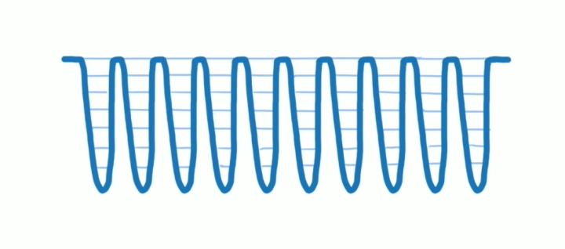
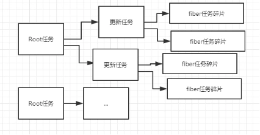

## Scheduler 任务调度器 需要实现哪些功能

合作式调度主要就是用来分配任务的，当有更新任务来的时候，不会马上去做 Diff 操作，而是先把当前的更新送入一个 Update Queue 中，然后交给 Scheduler 去处理，Scheduler 会根据当前主线程的使用情况去处理这次 Update。

scheduling(调度)是fiber reconciliation的一个过程，主要决定应该在何时做什么。
理想状况下reconciliation的过程应该是像下图所示一样，每次只做一个很小的任务，做完后能够“喘口气儿”，回到主线程看下有没有什么更高优先级的任务需要处理，如果又则先处理更高优先级的任务，没有则继续执行(cooperative scheduling 合作式调度)。

中间每一个波谷代表深入某个分片的执行过程，每个波峰就是一个分片执行结束交还控制权的时机。



UI来说还需要考虑以下问题：

- 并不是所有的state更新都需要立即显示出来，比如屏幕之外的部分的更新
- 并不是所有的更新优先级都是一样的，比如用户输入的响应优先级要比通过请求填充内容的响应优先级更高
- 理想情况下，对于某些高优先级的操作，应该是可以打断低优先级的操作执行的，比如用户输入时，页面的某个评论还在reconciliation，应该优先响应用户输入


## Scheduler 任务调度器 如何实现的

### 首先需要区分任务优先级

避免任务被饿死，可以设置一个超时时间. 这个超时时间不是死的，低优先级的可以慢慢等待, 高优先级的任务应该率先被执行.React 预定义了 5 个优先级:

- Immediate(-1) - 这个优先级的任务会同步执行, 或者说要马上执行且不能中断
- UserBlocking(250ms) 这些任务一般是用户交互的结果, 需要即时得到反馈
- Normal (5s) 应对哪些不需要立即感受到的任务，例如网络请求
- Low (10s) 这些任务可以放后，但是最终应该得到执行. 例如分析通知
- Idle (没有超时时间) 一些没有必要做的任务 (e.g. 比如隐藏的内容), 可能会被饿死


### 计算到期时间 expriationTime

expriationTime = 当前时间+任务优先级过期时间的常量 = performance.now() + timeout

任务级各自的对应的常量数值都是不同的，具体的内容如下:
```
   // 32位系统V8引擎里最大的整数。react用它来做IdlePriority的过期时间
   // Math.pow(2, 30) - 1
   var maxSigned31BitInt = 1073741823;

   // 立马过期 ==> ImmediatePriority
   var IMMEDIATE_PRIORITY_TIMEOUT = -1;
   // 250ms以后过期
   var USER_BLOCKING_PRIORITY = 250;
   //
   var NORMAL_PRIORITY_TIMEOUT = 5000;
   //
   var LOW_PRIORITY_TIMEOUT = 10000;
   // 永不过期
   var IDLE_PRIORITY = maxSigned31BitInt;//极端情况下你的网页tab如果能一直开着到12天半，任务才有可能过期

```
假设当前时间为 5000 并且分别有两个优先级不同的任务要执行。前者属于 ImmediatePriority，后者属于 UserBlockingPriority，那么两个任务计算出来的时间分别为 4999 和 5250。通过这个时间可以比对大小得出谁的优先级高，过期时间越小的代表优先级越高。如果过期时间已经比当前时间小了，说明这个任务已经过期了还没执行，需要立马去执行(asap)。

注意：这里与外面的updateContainer中调用`const expirationTime = computeExpirationForFiber(currentTime, current);`算出的大小与优先的关系是相反的，computeExpirationForFiber计算出的expirationTime越大优先级越大

### 如何以 expriationTime 作为优先级进行排序

React源码了有个unstable_scheduleCallback，意思是当前还是不稳定的，这里就以scheduleCallback作名字。
scheduleCallback双向循环链表的操作过程来进行优先级的排序

scheduleCallback两个参数：

- 第一个是要执行的callback,暂时可以理解为一个任务。
- 第二个参数是可选的，可以传入一个超时时间来标识这个任务过多久超时。
- 如果不传的话就会根据上述的任务优先级确定过期时间。

**一：首先我们需要根据入参或者当前的优先级来确定当前callback的过期时间并生成一个真正的任务节点**
```
  // schedule模块的全局变量
  var currentPriorityLevel = NormalPriority //这是一个全局变量，代表当前任务的优先级,默认为普通
  var scheduledHostCallback = null; //代表任务链表的执行器
  var timeoutTime = -1; //代表最高优先级任务firstCallbackNode的过期时间
  var activeFrameTime = 16; // 一帧的渲染时间16ms，这里假设 1s 60帧
  var frameDeadline = 0; //代表一帧的过期时间，通过rAF回调入参t加activeFrameTime来计算
  
  function scheduleCallback(callback, options? : {timeout:number} ) {
      var startTime = getCurrentTime()
      if (
          typeof options === 'object' &&
          options !== null &&
          typeof options.timeout === 'number'
        ){
          //如果传了options, 就用入参的过期时间
          expirationTime = startTime + options.timeout;
        } else {
          //判断当前的优先级
          switch (currentPriorityLevel) {
            case ImmediatePriority:
              expirationTime = startTime + IMMEDIATE_PRIORITY_TIMEOUT;
              break;
            case UserBlockingPriority:
              expirationTime = startTime + USER_BLOCKING_PRIORITY;
              break;
            case IdlePriority:
              expirationTime = startTime + IDLE_PRIORITY;
              break;
            case LowPriority:
              expirationTime = startTime + LOW_PRIORITY_TIMEOUT;
              break;
            case NormalPriority:
            default:
              expirationTime = startTime + NORMAL_PRIORITY_TIMEOUT;
          }
        }
        
        //上面确定了当前任务的截止时间，下面创建一个任务节点，
        var newNode = {
          callback, //任务的具体内容
          priorityLevel: currentPriorityLevel, //任务优先级
          expirationTime, //任务的过期时间
          next: null, //下一个节点
          previous: null, //上一个节点
        };
      //to be coutinued
  }

```

**二：把这个节点按照expirationTime排序插入到任务的链表里边去**

任务链表的特点：
- 双向链表
- expirationTime小的节点在最前面
- 是一条按照优先级高低降序排列的有序列表（表头优先级最大）

```
   // 代表任务链表的第一个节点
   var firstCallbackNode = null;
   
   function scheduleCallback(callback, options? : {timeout:number} ) {
       ...
       var newNode = {
           callback, //任务的具体内容
           priorityLevel: currentPriorityLevel, //任务优先级
           expirationTime, //任务的过期时间
           next: null, //下一个节点
           previous: null, //上一个节点
       };
       // 下面是按照 expirationTime 把 newNode 加入到任务队列里。
       if (firstCallbackNode === null) {
           firstCallbackNode = newNode.next = newNode.previous = newNode;
           ensureHostCallbackIsScheduled(); //这个方法先忽略，后面讲
       } else {
           var next = null;
           var node = firstCallbackNode;
           do {
             // 从链表头开始往后循环遍历
             // 如果找到本次要插入的节点expirationTime小于了链表中的expirationTime
             // 就停止遍历，然后进行插入操作
             if (node.expirationTime > expirationTime) {
               next = node;
               break;
             }
             node = node.next;
           } while (node !== firstCallbackNode);

       if (next === null) {
         next = firstCallbackNode;
       } else if (next === firstCallbackNode) {
         firstCallbackNode = newNode;
         ensureHostCallbackIsScheduled(); //这个方法先忽略，后面讲
       }
   
       var previous = next.previous;
       previous.next = next.previous = newNode;
       newNode.next = next;
       newNode.previous = previous;
     }
   
     return newNode;
       
   }

```

如上一个新进来的任务如何确定过期时间以及如何插入现有的任务队列功能基本实现
那么何时去执行任务呢？这就是通过ensureHostCallbackIsScheduled这个上面没有说的方法来实现的


### 何时去执行排好序的任务队列

### ensureHostCallbackIsScheduled

两种情况就对应ensureHostCallbackIsScheduled方法执行的两个分支：
- 1是当添加第一个任务节点的时候开始启动任务执行，
- 2是当新添加的任务取代之前的节点成为新的第一个节点的时候。因为1意味着任务从无到有，应该 立刻启动。2意味着来了新的优先级最高的任务，应该停止掉之前要执行的任务，重新从新的任务开始执行。

可以这么描述，在每一帧绘制完成之后的空闲时间。这样就能保证浏览器绘制每一帧的频率能跟上系统的刷新频率，不会掉帧。

```
function ensureHostCallbackIsScheduled() {
  // 调度正在执行 返回 也就是不能打断已经在执行的
  if (isExecutingCallback) {
    // Don't schedule work yet; wait until the next time we yield.
    return;
  }
  // Schedule the host callback using the earliest expiration in the list.
  // 让优先级最高的 进行调度 如果存在已经在调度的 直接取消
  var expirationTime = firstCallbackNode.expirationTime;
  if (!isHostCallbackScheduled) {
    isHostCallbackScheduled = true;
  } else {
    // Cancel the existing host callback.
    // 取消正在调度的callback
    cancelHostCallback();
  }
  // 发起调度
  requestHostCallback(flushWork, expirationTime);
}
```

```
  requestHostCallback = function(callback, absoluteTimeout) {
    // scheduledHostCallback就是flushWork
    scheduledHostCallback = callback;
    // timeoutTime就是callback链表的头部的expirationTime
    timeoutTime = absoluteTimeout;
    // isFlushingHostCallback 只在 channel.port1.onmessage 被设为 true
    // isFlushingHostCallback表示所添加的任务需要立即执行
    // 也就是说当正在执行任务或者新进来的任务已经过了过期时间
    // 马上执行新的任务，不再等到下一帧
    if (isFlushingHostCallback || absoluteTimeout < 0) {
      // absoluteTimeout < 0说明任务超时了，立刻执行，不要等下一帧
      // port就是port1
      port.postMessage(undefined);
    // isAnimationFrameScheduled是指animationTick函数是否在运行中
    // 第一次调用一定会走进这个分支
    } else if (!isAnimationFrameScheduled) {
      // isAnimationFrameScheduled 设为 true 的话就不会再进这个分支了
      // 但是内部会有机制确保 callback 执行
      isAnimationFrameScheduled = true;
      requestAnimationFrameWithTimeout(animationTick);
    }
  };

```

#### animationTick 记录每一帧的截止时间

```

    // rAF的回调是每一帧开始的时候，所以适合做一些轻量任务，不然会阻塞渲染。
    //rafTime就是回调拿到的帧开始时间
    function animationTick(rafTime) {
        // 有任务再进行递归，没任务的话不需要工作
        if (scheduledHostCallback !== null) {
            requestAnimationFrameWithTimeout(animationTick)
        }else {
          // No pending work. Exit.
          isAnimationFrameScheduled = false;
          return;
        }
        ...
        中间还有部分算法省略
        ...
        //计算当前帧的截止时间=开始时间+每一帧的渲染时间
        frameDeadline = rafTime + activeFrameTime; 
    }

```

#### 计算一帧内实际完成渲染的时间

首先了解一下消息信道
```
     var channel = new MessageChannel();
     var port = channel.port2; //port2用来发消息
     channel.port1.onmessage = function(event) {
        //port1监听消息的回调来做任务调度的具体工作，后面再说
        //onmessage的回调函数的调用时机是在一帧的paint完成之后,所以适合做一些重型任务，也能保证页面流畅不卡顿
     }

```

然后在requestAnimationFrame回调里发一个postMessage消息，channel.port1接受消息触发onmessage，onmessage是在paint（该帧实际渲染任务完成后）后调用，于是

每帧空闲的时间 = 帧的结束时间 - 完成任务的时间 = frameDeadline - currentTime

帧过期：每帧空闲的时间<=0
任务过期：任务设置的超时时间（timeoutTime） <= 当前时间（currentTime）

任务被执行有两种情况通过didTimeout这个字段来区分：

- didTimeout=false 表示帧没有过期
- didTimeout=true 当前帧过期且当前任务过期，还是得执行这次任务

```


     function animationTick(rafTime) {
        // 有任务再进行递归，没任务的话不需要工作
        if (scheduledHostCallback !== null) {
            requestAnimationFrame(animationTick)
        }
        //计算当前帧的截止时间，用开始时间加上每一帧的渲染时间
        frameDeadline = rafTime + activeFrameTime; 
        
        //新加的代码,在当前帧结束去搞一些事情
        port.postMessage(undefined);
    }
    
      
      channel.port1.onmessage = function(event) {
         var currentTime = getCurrentTime(); //获取当前时间，
         var didTimeout = false; //是否过期
         
         //下面的代码逻辑决定当前帧要不要执行任务
         // 1、如果当前帧没过期，说明当前帧有富余时间，可以执行任务
         // 2、如果当前帧过期了，说明当前帧没有时间了，这里再看一下当前任务   firstCallbackNode是否过期，如果过期了也要执行任务；如果当前任务没过期，说明不着急，那就先不执行去下一帧再说。
         if (frameDeadline - currentTime <= 0) {  // 当前帧过期
            // 排除当前任务过期的这种特殊情况，这种情况也是需要调用执行器，不能直接在外面return
            if (timeoutTime <= currentTime) {
                // 当前任务过期
                // timeoutTime 为当前任务的过期时间，会有个地方赋值。
                didTimeout = true;
            } else {
                //当前帧由于浏览器渲染等原因没有剩余时间，过期了，那就去下一帧再处理
                return;
            }
         }
         // 到了这里有两种情况
         //1是当前帧没过期;
         //2是当前帧过期且当前任务过期，也就是上面第二个if里的逻辑。
         //下面就是要调用执行器，依次执行链表里的任务
         scheduledHostCallback(didTimeout)
     }


```

#### 执行器执行队列任务 

scheduledHostCallback 也就是下面的flushWork

两重while循环，外层的while循环每次都会获取当前时间，内层循环根据这个当前时间去判断任务是否过期并执行。这样当内层执行了若干任务后，当前时间又会向前推进一块。外层循环再重新获取当前时间，直到没有任务过期或者没有任务为止。
```
    function flushWork(didTimeout) {
        if (didTimeout) { //任务过期
            while (firstCallbackNode !== null) {
                var currentTime = getCurrentTime(); //获取当前时间
                if (firstCallbackNode.expirationTime <= currentTime) {//如果队首任务时间比当前时间小，说明过期了 这里还需要判断是因为第二个任务不知道在第一个任务执行完后是否过期
                  do {
                    flushFirstCallback(); //执行队首任务，把队首任务从链表移除，并把第二个任务置为队首任务。执行任务可能产生新的任务，再把新任务插入到任务链表
                  } while (
                    firstCallbackNode !== null &&
                    firstCallbackNode.expirationTime <= currentTime
                  );
                  continue;
                }
                break;
            }
        }else{
            //当前帧有富余时间，while的逻辑是只要有任务且当前帧没过期就去执行任务。
             if (firstCallbackNode !== null) {
                do {
                  flushFirstCallback();//执行队首任务，把队首任务从链表移除，并把第二个任务置为队首任务。执行任务可能产生新的任务，再把新任务插入到任务链表
                } while (firstCallbackNode !== null && !shouldYieldToHost());
             }
        }
     //最后，如果还有任务的话，再启动一轮新的任务执行调度
        if (firstCallbackNode !== null) {
          ensureHostCallbackIsScheduled();
        }
        //最最后，如果还有任务且有最高优先级的任务，就都执行一遍。
        flushImmediateWork();
    }


```

上面的shouldYieldToHost代表当前帧过期了，取反的话就是没过期。每次while都会执行这个判断。
```
    shouldYieldToHost = function() {
        // 当前帧的截止时间比当前时间小则为true，代表当前帧过期了
        return frameDeadline <= getCurrentTime();
    };


```

### flushFirstCallback

先把该节点从链表中清掉， 然后调用callback函数， 并带入deadlineObject作为参数
```
function flushFirstCallback(node) {
  var flushedNode = firstCallbackNode;

  //从链表中清理掉该节点， 这样哪怕出错了， 也能保留原链表状态
  var next = firstCallbackNode.next;
  if (firstCallbackNode === next) {
    // This is the last callback in the list.
    firstCallbackNode = null;
    next = null;
  } else {
    var previous = firstCallbackNode.previous;
    firstCallbackNode = previous.next = next;
    next.previous = previous;
  }

  flushedNode.next = flushedNode.previous = null;

  // callback就是performAsyncWork
  var callback = flushedNode.callback;
  callback(deadlineObject);
}
```
## 

到这里就是unstable_scheduleCallback/scheduleCallback方法执行的全部流程，这个方法的调用就是在 updateQueue 后调用的 scheduleWork 方法里最后执行的，详细注明进入scheduleWork，在下一篇Render流程里

-----------------

###  scheduleWork（计划任务）

我们更新完 fiber的 updateQueue之后，就调用 scheduleWork 开始调度这次的工作。scheduleWork 主要的事情就是找到我们要处理的 root设置刚才获取到的执行优先级，然后调用 requestWork。

1、找到更新对应的FiberRoot节点（scheduleWorkToRoot）按照树的结构通过fiber.return一层层的返回，直到找到根节点。在向上找的过程中不断的更新每个节点对应的fiber对象的childExpirationTime。并且alternate同步更新。
注：childExpirationTime子树中最高优先级的expirationTime。

2、存在上一个任务，并且上一个执行没有执行完，执行权交给了浏览器，发现当前更新的优先级高于上一个任务，则重置stack（resetStack）
注：resetStack会从nextUnitOfWork开始一步一步往上恢复，可以说前一个任务执行的那一半白做了~因为现在有更高优先级的任务来插队了！你说气不气，但是世界就是这么残忍。

3、OK上面的2符合条件之后，如果现在不处于render阶段，或者nextRoot !== root，则作为享受vip待遇的任务可以请求调度了：requestWork。
注：如果正在处于render阶段，我们就不需要请求调度了，因为render阶段会处理掉这个update。


```
function scheduleWork(fiber: Fiber, expirationTime: ExpirationTime) {
  // 获取FiberRoot
  const root = scheduleWorkToRoot(fiber, expirationTime);
  if (root === null) {
    return;
  }

  // 这个分支表示高优先级任务打断低优先级任务
  // 这种情况发生于以下场景：有一个优先级较低的任务（必然是异步任务）没有执行完，
  // 执行权交给了浏览器，这个时候有一个新的高优先级任务进来了
  // 这时候需要去执行高优先级任务，所以需要打断低优先级任务
  if (
    !isWorking &&
    nextRenderExpirationTime !== NoWork &&
    expirationTime < nextRenderExpirationTime
  ) {
    // 记录被谁打断的
    interruptedBy = fiber;
    // 重置 stack
    resetStack();
  }
  // ......
  if (
    // If we're in the render phase, we don't need to schedule this root
    // for an update, because we'll do it before we exit...
    !isWorking ||
    isCommitting ||
    // ...unless this is a different root than the one we're rendering.
    nextRoot !== root
  ) {
    const rootExpirationTime = root.expirationTime;
    // 请求任务
    requestWork(root, rootExpirationTime);
  }

  // 在某些生命周期函数中 setState 会造成无限循环
  // 这里是告知你的代码触发无限循环了
  if (nestedUpdateCount > NESTED_UPDATE_LIMIT) {
    // Reset this back to zero so subsequent updates don't throw.
    nestedUpdateCount = 0;
    invariant(
      false,
      'Maximum update depth exceeded. This can happen when a ' +
        'component repeatedly calls setState inside ' +
        'componentWillUpdate or componentDidUpdate. React limits ' +
        'the number of nested updates to prevent infinite loops.',
    );
  }
}
```

### requestWork

将Root加入到Schedule（addRootToSchedule），如果此root已经调度过（已经在scheduledRoot的单向链表中），可能更新root.expirationTime。

它维护了一条 scheduledRoot 的单向链表，比如说 lastScheduleRoot == null，意味着我们当前已经没有要处理的 root，这时候就把 firstScheduleRoot、lastScheduleRoot、root.nextScheduleRoot 都设置为 root。如果 lastScheduleRoot !== null，则把 lastScheduledRoot.nextScheduledRoot设置为root，等 lastScheduledRoot调度完就会开始处理当前 root。

是否是同步任务？是：performSyncWork 否：scheduleCallbackWithExpirationTime
```
function requestWork(root: FiberRoot, expirationTime: ExpirationTime) {
  // 将Root加入到Schedule，更新root.expirationTime
  addRootToSchedule(root, expirationTime);
  if (isRendering) {
    // Prevent reentrancy. Remaining work will be scheduled at the end of
    // the currently rendering batch.
    return;
  }

  // 判断是否需要批量更新
  // 当我们触发事件回调时，其实回调会被 batchedUpdates 函数封装一次
  // 这个函数会把 isBatchingUpdates 设为 true，也就是说我们在事件回调函数内部
  // 调用 setState 不会马上触发 state 的更新及渲染，只是单纯创建了一个 updater，然后在这个分支 return 了
  // 只有当整个事件回调函数执行完毕后恢复 isBatchingUpdates 的值，并且执行 performSyncWork
  // 想必很多人知道在类似 setTimeout 中使用 setState 以后 state 会马上更新，如果你想在定时器回调中也实现批量更新，
  // 就可以使用 batchedUpdates 将你需要的代码封装一下
  if (isBatchingUpdates) {
    // Flush work at the end of the batch.
    // 判断是否不需要批量更新
    if (isUnbatchingUpdates) {
      // ...unless we're inside unbatchedUpdates, in which case we should
      // flush it now.
      nextFlushedRoot = root;
      nextFlushedExpirationTime = Sync;
      performWorkOnRoot(root, Sync, true);
    }
    return;
  }

  // TODO: Get rid of Sync and use current time?
  // 判断优先级是同步还是异步，异步的话需要调度
  if (expirationTime === Sync) {
    performSyncWork();
  } else {
    // 函数核心是实现了 requestIdleCallback 的 polyfill 版本
    // 因为这个函数浏览器的兼容性很差
    // 具体作用可以查看 MDN 文档 https://developer.mozilla.org/zh-CN/docs/Web/API/Window/requestIdleCallback
    // 这个函数可以让浏览器空闲时期依次调用函数，这就可以让开发者在主事件循环中执行后台或低优先级的任务，
    // 而且不会对像动画和用户交互这样延迟敏感的事件产生影响
    scheduleCallbackWithExpirationTime(root, expirationTime);
  }
}

function addRootToSchedule(root: FiberRoot, expirationTime: ExpirationTime) {
  // Add the root to the schedule.
  // Check if this root is already part of the schedule.
  // 判断 root 是否调度过
  if (root.nextScheduledRoot === null) {
    // This root is not already scheduled. Add it.
    // root 没有调度过
    root.expirationTime = expirationTime;
    if (lastScheduledRoot === null) {
      firstScheduledRoot = lastScheduledRoot = root;
      root.nextScheduledRoot = root;
    } else {
      lastScheduledRoot.nextScheduledRoot = root;
      lastScheduledRoot = root;
      lastScheduledRoot.nextScheduledRoot = firstScheduledRoot;
    }
  } else {
    // This root is already scheduled, but its priority may have increased.
    // root 已经调度过，判断是否需要更新优先级
    const remainingExpirationTime = root.expirationTime;
    if (
      remainingExpirationTime === NoWork ||
      expirationTime < remainingExpirationTime
    ) {
      // Update the priority.
      root.expirationTime = expirationTime;
    }
  }
}
```


### 同步更新performSyncWork

performSyncWork这个方法同步异步都会调用，同步调用的时候没有传参数，不会进入if，所以相当于直接执行performWork(NoWork, dl);异步调用首先进入到的是**scheduleCallbackWithExpirationTime方法，然后调用 unstable_scheduleCallback的时候把performAsyncWork方法当成回调传了进去，在浏览器空闲的时候调用，且在内部维护了一个异步更新队列，根据到期时间排序**

```
function performAsyncWork(dl) {
  if (dl.didTimeout) {
    // 刷新所有root的nextEpirationTimeToWorkOn
    if (firstScheduledRoot !== null) {
      recomputeCurrentRendererTime();
      var root = firstScheduledRoot;
      do {
        didExpireAtExpirationTime(root, currentRendererTime);
        // The root schedule is circular, so this is never null.
        root = root.nextScheduledRoot;
      } while (root !== firstScheduledRoot);
    }
  }
  performWork(NoWork, dl);
}
```


### 异步更新scheduleCallbackWithExpirationTime

1、如果有一个callback已经在调度（callbackExpirationTime !== NoWork ）的情况下，优先级大于当前callback（expirationTime > callbackExpirationTime），函数直接返回。如果优先级小于当前callback，就取消它的callback（cancelCallback(callbackID)）

2、计算出timeout然后scheduleCallback(priorityLevel, performAsyncWork, {timeout});

3、这里的scheduleCallback就是unstable_scheduleCallback方法

4、 unstable_scheduleCallback里面会在最后执行performAsyncWork完成在一帧空闲的时候调度然后调用performWork

```
function scheduleCallbackWithExpirationTime(
  root: FiberRoot,
  expirationTime: ExpirationTime,
) {
  // 判断上一个 callback 是否执行完毕
  if (callbackExpirationTime !== NoWork) {
    // A callback is already scheduled. Check its expiration time (timeout).
    // 当前任务如果优先级小于上个任务就退出
    if (expirationTime < callbackExpirationTime) {
      // Existing callback has sufficient timeout. Exit.
      return;
    } else {
      // 否则的话就取消上个 callback
      if (callbackID !== null) {
        // Existing callback has insufficient timeout. Cancel and schedule a
        // new one.
        cancelCallback(callbackID);
      }
    }
    // The request callback timer is already running. Don't start a new one.
  } else {
    // 没有需要执行的上一个 callback，开始定时器，这个函数用于 devtool
    startRequestCallbackTimer();
  }

  callbackExpirationTime = expirationTime;
  // 当前 performance.now() 和程序刚执行时的 performance.now() 相减
  const currentMs = now() - originalStartTimeMs;
  const expirationTimeMs = expirationTimeToMs(expirationTime);
  // 毫秒相减，优先级越大，算出来的值越小，可以自己模拟一下
  // 这个值在后面会和 performance.now() 相加再算出一个 expirationTime
  const timeout = expirationTimeMs - currentMs;
  // 获取优先级，这个优先级有五个，但是这个优先级其实在 scheduleCallback 函数中压根没用到
  const priorityLevel = getCurrentPriorityLevel();
  callbackID = scheduleCallback(priorityLevel, performAsyncWork, {timeout});
}
```

### performWork

1、如果是同步（deadline == null）,压根不考虑帧渲染是否有空余时间，同步任务也没有过期时间之说，遍历所有的root，并且把所有root中同步的任务全部执行掉。
注：有可能存在多个root，即有可能多次调用了ReactDOM.render。
2、如果是异步（deadline !== null）,遍历所有的root，执行完所有root中的过期任务，因为过期任务是必须要执行的。如果这一帧还有空闲时间，尽可能的执行更多任务。
3、上面两种情况都执行了任务，看看他们调用了什么方法呢？performWorkOnRoot。

```
// currentRendererTime 计算从页面加载到现在为止的毫秒数
// currentSchedulerTime 也是加载到现在的时间，isRendering === true的时候用作固定值返回，不然每次requestCurrentTime都会重新计算新的时间
function performWork(minExpirationTime: ExpirationTime, dl: Deadline | null) {
  // 这里注意deadline指向了传进来的deadlineObject对象（dl）
  deadline = dl;

  // Keep working on roots until there's no more work, or until we reach
  // the deadline.
  // 找到优先级最高的下一个需要渲染的 root: nextFlushedRoot 和对应的 expirtaionTime: nextFlushedExpirationTime
  findHighestPriorityRoot();

  // 异步
  if (deadline !== null) {
    // 重新计算 currentRendererTime
    recomputeCurrentRendererTime();
    currentSchedulerTime = currentRendererTime;

    // ......

    while (
      nextFlushedRoot !== null &&
      nextFlushedExpirationTime !== NoWork &&
      (minExpirationTime === NoWork ||
        minExpirationTime >= nextFlushedExpirationTime) &&
        // deadlineDidExpire 判断时间片是否过期， shouldYield 中判断
        // 当前渲染时间 currentRendererTime 比较 nextFlushedExpirationTime 判断任务是否已经超时
        // currentRendererTime >= nextFlushedExpirationTime 超时了
      (!deadlineDidExpire || currentRendererTime >= nextFlushedExpirationTime)
    ) {
      performWorkOnRoot(
        nextFlushedRoot,
        nextFlushedExpirationTime,
        currentRendererTime >= nextFlushedExpirationTime,
      );
      findHighestPriorityRoot();
      recomputeCurrentRendererTime();
      currentSchedulerTime = currentRendererTime;
    }
  } else {
    // 同步
    while (
      nextFlushedRoot !== null &&
      nextFlushedExpirationTime !== NoWork &&
      // 普通情况 minExpirationTime 应该就等于nextFlushedExpirationTime 因为都来自同一个 root，nextFlushedExpirationTime 是在 findHighestPriorityRoot 阶段读取出来的 root.expirationTime
      (minExpirationTime === NoWork ||
        minExpirationTime >= nextFlushedExpirationTime)
    ) {
      performWorkOnRoot(nextFlushedRoot, nextFlushedExpirationTime, true);
      findHighestPriorityRoot();
    }
  }

  // We're done flushing work. Either we ran out of time in this callback,
  // or there's no more work left with sufficient priority.

  // If we're inside a callback, set this to false since we just completed it.
  if (deadline !== null) {
    callbackExpirationTime = NoWork;
    callbackID = null;
  }
  // If there's work left over, schedule a new callback.
  if (nextFlushedExpirationTime !== NoWork) {
    scheduleCallbackWithExpirationTime(
      ((nextFlushedRoot: any): FiberRoot),
      nextFlushedExpirationTime,
    );
  }

  // Clean-up.
  deadline = null;
  deadlineDidExpire = false;

  finishRendering();
}
```


### performWorkOnRoot

1、首先说明执行任务的两个阶段：
renderRoot 渲染阶段
completeRoot 提交阶段
2、如果是同步或者任务已经过期的情况下，先renderRoot（传入参数isYieldy=false，代表任务不可以中断），随后completeRoot
3、如果是异步的话，先renderRoot（传入参数isYieldy=true，代表任务可以中断），完了之后看看这一帧是否还有空余时间，如果有的话completeRoot，没有时间了的话，只能等下一帧了。
4、在2、3步调用renderRoot之前还会做一件事，判断 finishedWork !== null ，因为前一个时间片可能 renderRoot 结束了没时间 completeRoot，如果在这个时间片中有完成 renderRoot 的 finishedWork 就直接 completeRoot。
```
function performWorkOnRoot(
  root: FiberRoot,
  expirationTime: ExpirationTime,
  isExpired: boolean,
) {
  // ......

  isRendering = true;

  // Check if this is async work or sync/expired work.
  if (deadline === null || isExpired) {
    // 同步或者任务已经过期，不可打断任务
    // 判断是否存在已完成的 finishedWork，存在话就完成它
    let finishedWork = root.finishedWork;
    if (finishedWork !== null) {
      completeRoot(root, finishedWork, expirationTime);
    } else {
      root.finishedWork = null;
      const timeoutHandle = root.timeoutHandle;
      if (timeoutHandle !== noTimeout) {
        root.timeoutHandle = noTimeout;
        cancelTimeout(timeoutHandle);
      }
      const isYieldy = false;
      // 否则就去渲染成 DOM
      renderRoot(root, isYieldy, isExpired);
      finishedWork = root.finishedWork;
      if (finishedWork !== null) {
        completeRoot(root, finishedWork, expirationTime);
      }
    }
  } else {
    // 异步任务未过期，可打断任务
    // Flush async work.
    let finishedWork = root.finishedWork;
    if (finishedWork !== null) {
      // This root is already complete. We can commit it.
      completeRoot(root, finishedWork, expirationTime);
    } else {
      root.finishedWork = null;
      const timeoutHandle = root.timeoutHandle;
      if (timeoutHandle !== noTimeout) {
        root.timeoutHandle = noTimeout;
        cancelTimeout(timeoutHandle);
      }
      const isYieldy = true;
      renderRoot(root, isYieldy, isExpired);
      finishedWork = root.finishedWork;
      if (finishedWork !== null) {
        if (!shouldYield()) {
          completeRoot(root, finishedWork, expirationTime);
        } else {
          root.finishedWork = finishedWork;
        }
      }
    }
  }

  isRendering = false;
}
```

### renderRoot

renderRoot的产物会挂载到root的finishWork属性上， 首先performWorkOnRoot会先判断root的finishWork是否不为空， 如果存在的话则直接进入commit的阶段， 否则进入到renderRoot函数， 设置finishWork属性
renderRoot有三个参数， renderRoot(root, isYieldy, isExpired)， 同步状态下isYield的值是false,
renderRoot 先将 isWorking设为true

创建第一个nextUnitOfWork, 也就是一个工作单元

1、nextUnitOfWork = createWorkInProgress() 拷贝一份 fiber 节点，在 nextUnitOfWork 中修改，防止改变当前 fiberTree。nextUnitOfWork 是下一个要更新的节点，这个nextUnitOfWork, 也是root.current的alternater属性， 而它的alternate属性则指向了root.current， 形成了一个双缓冲池。
2、进入workLoop。

```
// 开始渲染整颗树，这个函数在异步模式下可能会被多次执行，因为在异步模式下
// 可以打断任务。打断也就意味着每次都得回到 root 再开始从上往下循环
function renderRoot(
  root: FiberRoot,
  isYieldy: boolean,
  isExpired: boolean,
): void {
  isWorking = true;
  ReactCurrentOwner.currentDispatcher = Dispatcher;

  const expirationTime = root.nextExpirationTimeToWorkOn;

  // Check if we're starting from a fresh stack, or if we're resuming from
  // previously yielded work.
  if (
    expirationTime !== nextRenderExpirationTime ||
    root !== nextRoot ||
    nextUnitOfWork === null
  ) {
    // Reset the stack and start working from the root.
    resetStack();
    nextRoot = root;
    nextRenderExpirationTime = expirationTime;
    // 获取下一个需要工作的单元
    nextUnitOfWork = createWorkInProgress(
      // FiberRoot 对应的 Rootfiber
      nextRoot.current,
      null,
      nextRenderExpirationTime,
    );
    root.pendingCommitExpirationTime = NoWork;
    // ......
  }
  // ......
  do {
    try {
      // 循环更新节点
      workLoop(isYieldy);
    } catch (thrownValue) {
      // 遇到某种错误
    break;
  } while (true);

  // 这里有一大堆的错误处理
  
  // Ready to commit.
  onComplete(root, rootWorkInProgress, expirationTime);
}
```

### workLoop

循环单元更新，对整颗 fiberTree 都遍历一遍。

还记得之前传入进来的isYieldy的么，如果为false，不可中断，不断的更新下一个节点任务（performUnitOfWork(nextUnitOfWork)），知道整棵树更新完毕。如果可以中断，通过shouldYield()判断当前帧是否还有时间更新，有时间就更新，没有时间了就不更了。

```
function workLoop(isYieldy) {
  // 对 nextUnitOfWork 循环进行判断，直到没有 nextUnitOfWork
  if (!isYieldy) {
    // 不可中断
    // Flush work without yielding
    while (nextUnitOfWork !== null) {
      // 一开始进来 nextUnitOfWork 是 root，每次执行 performUnitOfWork 后
      // 都会生成下一个工作单元
      nextUnitOfWork = performUnitOfWork(nextUnitOfWork);
    }
  } else {
    // 可中断
    // Flush asynchronous work until the deadline runs out of time.
    while (nextUnitOfWork !== null && !shouldYield()) {
      nextUnitOfWork = performUnitOfWork(nextUnitOfWork);
    }
  }
}
```

### performUnitOfWork

1、调用beginWork()更新当前任务节点
2、如果当前fiber树已经更新到叶子节点了，则调用completeUnitOfWork更新。

```
// 开始组件更新
function performUnitOfWork(workInProgress: Fiber): Fiber | null {
  // The current, flushed, state of this fiber is the alternate.
  // Ideally nothing should rely on this, but relying on it here
  // means that we don't need an additional field on the work in
  // progress.
  // 获得 fiber 的替身，调和这一阶段都是在替身上完成的
  // 然后直接看 beginWork
  const current = workInProgress.alternate;

  // ......
  let next;

  // .....
  // 开始工作
  next = beginWork(current, workInProgress, nextRenderExpirationTime);
  workInProgress.memoizedProps = workInProgress.pendingProps;

  // ......

  // 当前fiber树已经更新到叶子节点了
  if (next === null) {
    // If this doesn't spawn new work, complete the current work.
    next = completeUnitOfWork(workInProgress);
  }

  ReactCurrentOwner.current = null;

  return next;
}
```

### beginWork

beginWork 应该是第一个具体操作到fiber的方法，会根据我们 workInProgress.tag 来调用对应的操作方法来创建一个fiber节点，绑定到fiber tree上面，然后返回下一个工作单元(nextUnitOfWork)回到 workLoop 继续循环这个过程，直到整个fiber tree都创建完毕。

```
function beginWork(
  current: Fiber | null,
  workInProgress: Fiber,
  renderExpirationTime: ExpirationTime,
): Fiber | null {
  const updateExpirationTime = workInProgress.expirationTime;

  if (current !== null) {
    const oldProps = current.memoizedProps;
    const newProps = workInProgress.pendingProps;
    // 判断 props 和 context 是否改变
    // 判断当前 fiber 的优先级是否小于本次渲染的优先级，小于的话可以跳过
    if (
      oldProps === newProps &&
      !hasLegacyContextChanged() &&
      (updateExpirationTime === NoWork ||
        updateExpirationTime > renderExpirationTime)
    ) {
      // ......
      }
      // bailoutOnAlreadyFinishedWork 会判断这个 fiber 的子树是否需要更新，如果有需要更新会 clone 一份到 workInProgress.child 返回到 workLoop 的 nextUnitOfWork, 否则为 null
      return bailoutOnAlreadyFinishedWork(
        current,
        workInProgress,
        renderExpirationTime,
      );
    }
  }

  // Before entering the begin phase, clear the expiration time.
  // 进行更新先把当前 fiber 的 expirationTime 设置为 NoWork
  workInProgress.expirationTime = NoWork;
  // 根据 fiber 的 tag 类型进行更新
  switch (workInProgress.tag) {
    case IndeterminateComponent: ......
    case LazyComponent: ......
    case FunctionComponent: ......
    case ClassComponent: ......
    case HostRoot:......
    case HostComponent:......
    case HostText:......
    case SuspenseComponent:......
    case HostPortal:......
    case ForwardRef: ......
    case Fragment:......
    case Mode:......
    case Profiler:......
    case ContextProvider:......
    case ContextConsumer:......
    case MemoComponent: ......
    case SimpleMemoComponent: ......
    case IncompleteClassComponent:......
    default:
      invariant(
        false,
        'Unknown unit of work tag. This error is likely caused by a bug in ' +
          'React. Please file an issue.',
      );
  }
}
```

### beginWork对ClassComponent更新

这个函数的作用是对未初始化的类组件进行初始化，对已经初始化的组件更新重用。
完成组件实例的 state、props 的更新;
执行 componentWillUpdate、shouldComponentUpdate等生命周期函数；
完成组件实例的渲染；
返回下一个待处理的任务单元；
```
case ClassComponent: {
    const Component = workInProgress.type;
    const unresolvedProps = workInProgress.pendingProps;
    const resolvedProps =
    workInProgress.elementType === Component
        ? unresolvedProps
        : resolveDefaultProps(Component, unresolvedProps);
    return updateClassComponent(
    current,
    workInProgress,
    Component,
    resolvedProps,
    renderExpirationTime,
    );
}


function updateClassComponent(
  current: Fiber | null,
  workInProgress: Fiber,
  Component: any,
  nextProps,
  renderExpirationTime: ExpirationTime,
) {
  // 获取组件实例
  const instance = workInProgress.stateNode;

  // ...省略...

  let shouldUpdate;

  /**
   * 1. 完成组件实例的state、props的更新;
   * 2. componentWillUpdate、shouldComponentUpdate生命周期函数执行完毕；
   * 3. 获取是否要进行更新的标识shouldUpdate；
   */
  shouldUpdate = updateClassInstance(
    current,
    workInProgress,
    Component,
    nextProps,
    renderExpirationTime,
  );

  /**
   * 1. 如果shouldUpdate值为false，则退出渲染；
   * 2. 执行render函数
   */
  const nextUnitOfWork = finishClassComponent(
    current,
    workInProgress,
    Component,
    shouldUpdate,
    hasContext,
    renderExpirationTime,
  );

  // 返回下一个任务单元
  return nextUnitOfWork;
}


```

### finishClassComponent

这个方法的最后会调用reconcileChildren进入diff算法
```
function finishClassComponent(
  current: Fiber | null,
  workInProgress: Fiber,
  Component: any,
  shouldUpdate: boolean,
  hasContext: boolean,
  renderExpirationTime: ExpirationTime,
) {
  // Refs should update even if shouldComponentUpdate returns false
  // 更新 ref，即使不需要更新组件
  markRef(current, workInProgress);

  const didCaptureError = (workInProgress.effectTag & DidCapture) !== NoEffect;

  if (!shouldUpdate && !didCaptureError) {
    // Context providers should defer to sCU for rendering
    if (hasContext) {
      invalidateContextProvider(workInProgress, Component, false);
    }

    return bailoutOnAlreadyFinishedWork(
      current,
      workInProgress,
      renderExpirationTime,
    );
  }

  const instance = workInProgress.stateNode;

  // Rerender
  ReactCurrentOwner.current = workInProgress;
  let nextChildren;
  if (
    didCaptureError &&
    typeof Component.getDerivedStateFromError !== 'function'
  ) {
    // If we captured an error, but getDerivedStateFrom catch is not defined,
    // unmount all the children. componentDidCatch will schedule an update to
    // re-render a fallback. This is temporary until we migrate everyone to
    // the new API.
    // TODO: Warn in a future release.
    nextChildren = null;

    if (enableProfilerTimer) {
      stopProfilerTimerIfRunning(workInProgress);
    }
  } else {
    if (__DEV__) {
      setCurrentPhase('render');
      nextChildren = instance.render();
      if (
        debugRenderPhaseSideEffects ||
        (debugRenderPhaseSideEffectsForStrictMode &&
          workInProgress.mode & StrictMode)
      ) {
        instance.render();
      }
      setCurrentPhase(null);
    } else {
      nextChildren = instance.render();
    }
  }

  // React DevTools reads this flag.
  workInProgress.effectTag |= PerformedWork;
  // 开始 diff 算法，生成新的 children
  if (current !== null && didCaptureError) {
    // If we're recovering from an error, reconcile without reusing any of
    // the existing children. Conceptually, the normal children and the children
    // that are shown on error are two different sets, so we shouldn't reuse
    // normal children even if their identities match.
    forceUnmountCurrentAndReconcile(
      current,
      workInProgress,
      nextChildren,
      renderExpirationTime,
    );
  } else {
    reconcileChildren(
      current,
      workInProgress,
      nextChildren,
      renderExpirationTime,
    );
  }

  // Memoize state using the values we just used to render.
  // TODO: Restructure so we never read values from the instance.
  workInProgress.memoizedState = instance.state;

  // The context might have changed so we need to recalculate it.
  if (hasContext) {
    invalidateContextProvider(workInProgress, Component, true);
  }
  // 最后把新的第一个 child 返回出去作为下一个工作节点
  return workInProgress.child;
}
```

### updateClassInstance

之前我们的fiber节点上面有一个更新的队列，就是在这里使用的
`let updateQueue = workInProgress.updateQueue;`就是取出之前维护的更新队列
```
function updateClassInstance(
  current: Fiber,
  workInProgress: Fiber,
  ctor: any,
  newProps: any,
  renderExpirationTime: ExpirationTime,
): boolean {
  // 获取当前实例
  const instance = workInProgress.stateNode;

  // ...省略...

  const oldState = workInProgress.memoizedState;
  let newState = (instance.state = oldState);
  let updateQueue = workInProgress.updateQueue;

  // 如果更新队列不为空，则处理更新队列，并将最终要更新的state赋值给newState
  if (updateQueue !== null) {
    processUpdateQueue(
      workInProgress,
      updateQueue,
      newProps,
      instance,
      renderExpirationTime,
    );
    newState = workInProgress.memoizedState;
  }

  // ...省略...

  /**
   * shouldUpdate用于标识组件是否要进行渲染，其值取决于组件的shouldComponentUpdate生命周期执行结果，
   * 亦或者PureComponent的浅比较的返回结果。
   */
  const shouldUpdate = checkShouldComponentUpdate(
      workInProgress,
      ctor,
      oldProps,
      newProps,
      oldState,
      newState,
      nextContext,
    );

  if (shouldUpdate) {
     // 如果需要更新，则执行相应的生命周期函数
     if (typeof instance.UNSAFE_componentWillUpdate === 'function' ||
        typeof instance.componentWillUpdate === 'function') {
      startPhaseTimer(workInProgress, 'componentWillUpdate');
      if (typeof instance.componentWillUpdate === 'function') {
        instance.componentWillUpdate(newProps, newState, nextContext);
      }
      if (typeof instance.UNSAFE_componentWillUpdate === 'function') {
        instance.UNSAFE_componentWillUpdate(newProps, newState, nextContext);
      }
      stopPhaseTimer();
    }
    // ...省略...
  }

  // ...省略...

  /**
   * 不管shouldUpdate的值是true还是false，都会更新当前组件实例的props和state的值，
   * 即组件实例的state和props的引用地址发生变化。也就是说即使我们采用PureComponent来减少无用渲染，
   * 但并不代表该组件的state或者props的引用地址没有发生变化！！！
   */
  instance.props = newProps;
  instance.state = newState;

  return shouldUpdate;
}

```

### processUpdateQueue

上一步取出updateQueue后用了这个processUpdateQueue函数来处理，这里有批量更新处理的逻辑代码

React 组件渲染之前，我们通常会多次调用setState，每次调用setState都会产生一个 update 对象。这些 update 对象会以链表的形式存在队列 queue 中。processUpdateQueue函数会对这个队列进行依次遍历，每次遍历会将上一次的prevState与 update 对象的partialState进行合并，当完成所有遍历后，就能算出最终要更新的状态 state，此时会将其存储在 workInProgress 的memoizedState属性上。

```
export function processUpdateQueue<State>(
  workInProgress: Fiber,
  queue: UpdateQueue<State>,
  props: any,
  instance: any,
  renderExpirationTime: ExpirationTime,
): void {
  // ...省略...

  // 获取上次状态prevState
  let newBaseState = queue.baseState;

  /**
   * 若在render之前多次调用了setState，则会产生多个update对象。这些update对象会以链表的形式存在queue中。
   * 现在对这个更新队列进行依次遍历，并计算出最终要更新的状态state。
   */
  let update = queue.firstUpdate;
  let resultState = newBaseState;
  while (update !== null) {
    // ...省略...

    /**
     * resultState作为参数prevState传入getStateFromUpdate，然后getStateFromUpdate会合并生成
     * 新的状态再次赋值给resultState。完成整个循环遍历，resultState即为最终要更新的state。
     */
    resultState = getStateFromUpdate(
      workInProgress,
      queue,
      update,
      resultState,
      props,
      instance,
    );
    // ...省略...

    // 遍历下一个update对象
    update = update.next;
  }

  // ...省略...

  // 将处理后的resultState更新到workInProgess上
  workInProgress.memoizedState = resultState;
}

```

### getStateFromUpdate

getStateFromUpdate 函数主要功能是将存储在更新对象update上的partialState与上一次的prevState进行对象合并，生成一个全新的状态 state。

注意：
- Object.assign 第一个参数是空对象，也就是说新的 state 对象的引用地址发生了变化。
- Object.assign 进行的是浅拷贝，不是深拷贝。

```
function getStateFromUpdate<State>(
  workInProgress: Fiber,
  queue: UpdateQueue<State>,
  update: Update<State>,
  prevState: State,
  nextProps: any,
  instance: any,
): any {
  switch (update.tag) {

    // ....省略 ....

    // 调用setState会创建update对象，其属性tag当时被标记为UpdateState
    case UpdateState: {
      // payload 存放的是要更新的状态state
      const payload = update.payload;
      let partialState;

      // 获取要更新的状态
      if (typeof payload === 'function') {
        partialState = payload.call(instance, prevState, nextProps);
      } else {
        partialState = payload;
      }

      // partialState 为null 或者 undefined，则视为未操作，返回上次状态
      if (partialState === null || partialState === undefined) {
        return prevState;
      }

      // 注意：此处通过Object.assign生成一个全新的状态state， state的引用地址发生了变化。
      return Object.assign({}, prevState, partialState);
    }

    // .... 省略 ....
  }

  return prevState;
}

```

### 如何回到中断

#### 任务中断（setState），执行高优先级任务后如何回来被中断的任务

React内部维护一个任务链表，每次某个任务结束后都会删除已完成的任务并继续执行其他可执行的任务，每个任务都有一个finishedWork属性，如果该属性不为null，则说明更新完毕，只差commit render阶段

#### 回到中断任务后，如何从中断的任务片开始（fiber单位任务碎片）

这个主要依赖于fiber中的两个属性expirationTime和childExpirationTime，当某个fiber被执行完毕后，会把expirationTime设为NoWork，即被打断后可以通过该属性判断任务碎片是否需要执行

#### 任务中断再执行的流程

通过深度遍历搜索算法对每一个fiber即任务碎片进行更新
每一个任务碎片完成后会将expirationTime设为NoWork
假设此时有更高优先级的任务，则执行更高优先级任务
任务执行完成后，会从任务列表中剔除，并继续执行其他未完成且可以执行的任务。
回到被打断任务，可以通过任务的finishWork属性判断是否需要执行更新
根据任务碎片的expirationTime判断是否需要执行更新




