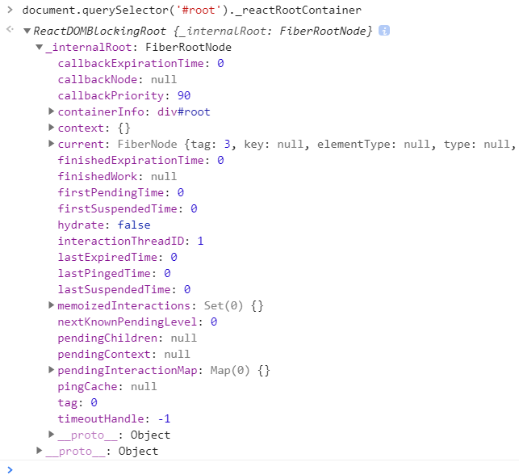
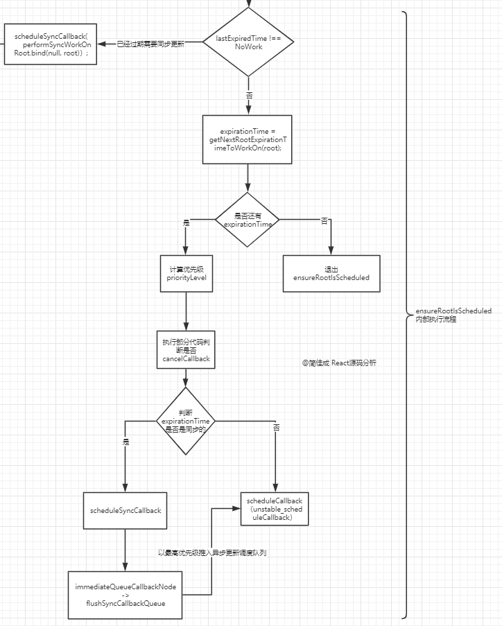
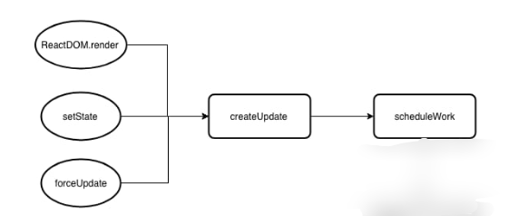

>之前调度器是React16.8，这里升级成了React16.10来对比看了下，整体流程没有变，就是有些地方好像封装了下，变得抽象了一些

## ReactDOM

实现看我们平时的Index.js,里面有一个ReactDOM.render()方法这是渲染的入口;
`<App />`是JSX语法，通过Babel编译会转化成一个描述UI的对象
第二个参数即为我们的容积
```
import React from 'react';
import ReactDOM from 'react-dom';
import './index.css';
import App from './App';
import * as serviceWorker from './serviceWorker';

ReactDOM.render(<App />, document.getElementById('root'));
```

## ReactDOM对象

ReactDOM是一个比较复杂的对象，里面有很多方法，我们只需要看到hydrate，render这两个方法，这两个方法很类似，hydrate服务端渲染的时候用，render就是我们index里面调用的那个render 

两个方法最后都会调用legacyRenderSubtreeIntoContainer方法
```
const ReactDOM: Object = {
  ...
  /**
   * 服务端渲染
   * @param element 表示一个ReactNode，可以是一个ReactElement对象
   * @param container 需要将组件挂载到页面中的DOM容器
   * @param callback 渲染完成后需要执行的回调函数
   */
  hydrate(element: React$Node, container: DOMContainer, callback: ?Function) {
    invariant(
      isValidContainer(container),
      'Target container is not a DOM element.',
    );
    ...
    // TODO: throw or warn if we couldn't hydrate?
    // 注意第一个参数为null，第四个参数为true
    return legacyRenderSubtreeIntoContainer(
      null,
      element,
      container,
      true,
      callback,
    );
  },

  /**
   * 客户端渲染
   * @param element 表示一个ReactElement对象
   * @param container 需要将组件挂载到页面中的DOM容器
   * @param callback 渲染完成后需要执行的回调函数
   */
  render(
    element: React$Element<any>,
    container: DOMContainer,
    callback: ?Function,
  ) {
    invariant(
      isValidContainer(container),
      'Target container is not a DOM element.',
    );
    ...
    // 注意下 forceHydrate 参数，为 true 时是服务端渲染，这部分内容笔者不会讲到
    // 调用 render 函数的话这个值永远为 false，调用 hydrate 函数的话这个值会为 true
    return legacyRenderSubtreeIntoContainer(
      null,
      element,
      container,
      false,
      callback,
    );
  },
  ...
};

```

## legacyRenderSubtreeIntoContainer

```
/**
 * 开始构建FiberRoot和RootFiber，之后开始执行更新任务
 * @param parentComponent 父组件，可以把它当成null值来处理
 * @param children ReactDOM.render()或者ReactDOM.hydrate()中的第一个参数，可以理解为根组件
 * @param container ReactDOM.render()或者ReactDOM.hydrate()中的第二个参数，组件需要挂载的DOM容器
 * @param forceHydrate 表示是否融合，用于区分客户端渲染和服务端渲染，render方法传false，hydrate方法传true
 * @param callback ReactDOM.render()或者ReactDOM.hydrate()中的第三个参数，组件渲染完成后需要执行的回调函数
 * @returns {*}
 */
function legacyRenderSubtreeIntoContainer(
  parentComponent: ?React$Component<any, any>,
  children: ReactNodeList,
  container: DOMContainer,
  forceHydrate: boolean,
  callback: ?Function,
) {
  ...
  // TODO: Without `any` type, Flow says "Property cannot be accessed on any
  // member of intersection type." Whyyyyyy.
  // 在第一次执行的时候，container上是肯定没有_reactRootContainer属性的
  // 所以第一次执行时，root肯定为undefined
  let root: _ReactSyncRoot = (container._reactRootContainer: any);
  let fiberRoot;
  if (!root) {
    // Initial mount
    // 首次挂载，进入当前流程控制中，container._reactRootContainer指向一个ReactSyncRoot实例
    root = container._reactRootContainer = legacyCreateRootFromDOMContainer(
      container,
      forceHydrate,
    );
    // root表示一个ReactSyncRoot实例，实例中有一个_internalRoot方法指向一个fiberRoot实例
    fiberRoot = root._internalRoot;
    // callback表示ReactDOM.render()或者ReactDOM.hydrate()中的第三个参数
    // 重写callback，通过fiberRoot去找到其对应的rootFiber，然后将rootFiber的第一个child的stateNode作为callback中的this指向
    // 一般情况下我们很少去写第三个参数，所以可以不必关心这里的内容
    if (typeof callback === 'function') {
      const originalCallback = callback;
      callback = function() {
        const instance = getPublicRootInstance(fiberRoot);
        originalCallback.call(instance);
      };
    }
    // Initial mount should not be batched.
    // 对于首次挂载来说，更新操作不应该是批量的，所以会先执行unbatchedUpdates方法
    // 该方法中会将executionContext(执行上下文)切换成LegacyUnbatchedContext(非批量上下文)
    // 切换上下文之后再调用updateContainer执行更新操作
    // 执行完updateContainer之后再将executionContext恢复到之前的状态
    unbatchedUpdates(() => {
      updateContainer(children, fiberRoot, parentComponent, callback);
    });
  } else {
    // 不是首次挂载，即container._reactRootContainer上已经存在一个ReactSyncRoot实例
    fiberRoot = root._internalRoot;
    // 下面的控制语句和上面的逻辑保持一致
    if (typeof callback === 'function') {
      const originalCallback = callback;
      callback = function() {
        const instance = getPublicRootInstance(fiberRoot);
        originalCallback.call(instance);
      };
    }
    // Update
    // 对于非首次挂载来说，是不需要再调用unbatchedUpdates方法的
    // 即不再需要将executionContext(执行上下文)切换成LegacyUnbatchedContext(非批量上下文)
    // 而是直接调用updateContainer执行更新操作
    updateContainer(children, fiberRoot, parentComponent, callback);
  }
  return getPublicRootInstance(fiberRoot);
}

```

## legacyCreateRootFromDOMContainer

legacyCreateRootFromDOMContainer会让container._reactRootContainer挂载ReactRoot

可以通过document.querySelector('#root')._reactRootContainer来查看



```
/**
 * 创建并返回一个ReactSyncRoot实例
 * @param container ReactDOM.render()或者ReactDOM.hydrate()中的第二个参数，组件需要挂载的DOM容器
 * @param forceHydrate 是否需要强制融合，render方法传false，hydrate方法传true
 * @returns {ReactSyncRoot}
 */
function legacyCreateRootFromDOMContainer(
  container: DOMContainer,
  forceHydrate: boolean,
): _ReactSyncRoot {
  // 判断是否需要融合
  const shouldHydrate =
    forceHydrate || shouldHydrateDueToLegacyHeuristic(container);
  // First clear any existing content.
  // 针对客户端渲染的情况，需要将container容器中的所有元素移除
  // 一般来说我们都是这样写 container 的： <div id='root'></div> 内部不要写任何的节点
  if (!shouldHydrate) {
    let warned = false;
    let rootSibling;
    // 循环遍历每个子节点进行删除
    while ((rootSibling = container.lastChild)) {
      ...
      container.removeChild(rootSibling);
    }
  }
  ...
  // Legacy roots are not batched.
  // 返回一个ReactSyncRoot实例
  // 该实例具有一个_internalRoot属性指向fiberRoot
  return new ReactSyncRoot(
    container,
    LegacyRoot,
    shouldHydrate
      ? {
          hydrate: true,
        }
      : undefined,
  );
}

```

前面的shouldHydrateDueToLegacyHeuristic还是和服务端渲染有关

data-reactrootx渲染会有data-reactroot属性，需要区分
```

<body>
    <div id="root">
        <div data-reactroot=""></div>
    </div>
</body>

```

首先根据container来获取DOM容器中的第一个子节点
获取该子节点的目的在于通过节点的nodeType和是否具有ROOT_ATTRIBUTE_NAME属性来区分是客户端渲染还是服务端渲染
ROOT_ATTRIBUTE_NAME位于表示data-reactroot属性


```
/**
 * 根据nodeType和attribute判断是否需要融合
 * @param container DOM容器
 * @returns {boolean}
 */
function shouldHydrateDueToLegacyHeuristic(container) {
  const rootElement = getReactRootElementInContainer(container);
  return !!(
    rootElement &&
    rootElement.nodeType === ELEMENT_NODE &&
    rootElement.hasAttribute(ROOT_ATTRIBUTE_NAME)
  );
}

/**
 * 根据container来获取DOM容器中的第一个子节点
 * @param container DOM容器
 * @returns {*}
 */
function getReactRootElementInContainer(container: any) {
  if (!container) {
    return null;
  }

  if (container.nodeType === DOCUMENT_NODE) {
    return container.documentElement;
  } else {
    return container.firstChild;
  }
}

```

## ReactSyncRoot

上面的legacyCreateRootFromDOMContainer方法经过一一系列处理后返回了一个ReactSyncRoot实例，现在分析下ReactSyncRoot里面干了什么
```
/**
 * ReactSyncRoot构造函数
 * @param container DOM容器
 * @param tag fiberRoot节点的标记(LegacyRoot、BatchedRoot、ConcurrentRoot)
 * @param options 配置信息，只有在hydrate时才有值，否则为undefined
 * @constructor
 */
function ReactSyncRoot(
  container: DOMContainer,
  tag: RootTag,
  options: void | RootOptions,
) {
  this._internalRoot = createRootImpl(container, tag, options);
}


/**
 * 创建并返回一个fiberRoot
 * @param container DOM容器
 * @param tag fiberRoot节点的标记(LegacyRoot、BatchedRoot、ConcurrentRoot)
 * @param options 配置信息，只有在hydrate时才有值，否则为undefined
 * @returns {*}
 */
function createRootImpl(
  container: DOMContainer,
  tag: RootTag,
  options: void | RootOptions,
) {
  // Tag is either LegacyRoot or Concurrent Root
  // 判断是否是hydrate模式
  const hydrate = options != null && options.hydrate === true;
  const hydrationCallbacks =
    (options != null && options.hydrationOptions) || null;
  
  // 创建一个fiberRoot
  const root = createContainer(container, tag, hydrate, hydrationCallbacks);
  // 给container附加一个内部属性用于指向fiberRoot的current属性对应的rootFiber节点
  markContainerAsRoot(root.current, container);
  if (hydrate && tag !== LegacyRoot) {
    const doc =
      container.nodeType === DOCUMENT_NODE
        ? container
        : container.ownerDocument;
    eagerlyTrapReplayableEvents(doc);
  }
  return root;
}

/**
 * 内部调用createFiberRoot方法返回一个fiberRoot实例
 * @param containerInfo DOM容器
 * @param tag fiberRoot节点的标记(LegacyRoot、BatchedRoot、ConcurrentRoot)
 * @param hydrate 判断是否是hydrate模式
 * @param hydrationCallbacks 只有在hydrate模式时才可能有值，该对象包含两个可选的方法：onHydrated和onDeleted
 * @returns {FiberRoot}
 */
export function createContainer(
  containerInfo: Container,
  tag: RootTag,
  hydrate: boolean,
  hydrationCallbacks: null | SuspenseHydrationCallbacks,
): OpaqueRoot {
  return createFiberRoot(containerInfo, tag, hydrate, hydrationCallbacks);
}


```

可以看到函数通过调用ReactSyncRoot->createRootImpl->createContainer->createFiberRoot，返回来一个root，所以createFiberRoot才是关键,下面重点介绍


## FiberRoot与RootFiber

FiberRoot的含义与作用：

（1）FiberRoot是整个React应用的起点
（2）FiberRoot包含应用挂载的目标节点（`<div id='root'>root</div>`）
（3）FiberRoot记录整个React应用 更新过程中的各种信息

FiberRoot与RootFiber的关系:
```
FiberRoot.current = RootFiber
RootFiber.stateNode = FiberRoot
```

**注意：FiberRoot是通过new FiberRootNode()创建，RootFiber是通过new FiberNode()最终创建，两个数据类型有很大差别**


### FiberRoot 的结构

```js
type BaseFiberRootProperties = {|
  // root节点，render方法接收的第二个参数
  containerInfo: any,
  // 只有在持久更新中会用到，也就是不支持增量更新的平台，react-dom不会用到
  pendingChildren: any,
  // 当前应用对应的Fiber对象，是Root Fiber
  current: Fiber,

  // 一下的优先级是用来区分
  // 1) 没有提交(committed)的任务
  // 2) 没有提交的挂起任务
  // 3) 没有提交的可能被挂起的任务
  // 我们选择不追踪每个单独的阻塞登记，为了兼顾性能
  // The earliest and latest priority levels that are suspended from committing.
  // 最老和新的在提交的时候被挂起的任务
  earliestSuspendedTime: ExpirationTime,
  latestSuspendedTime: ExpirationTime,
  // The earliest and latest priority levels that are not known to be suspended.
  // 最老和最新的不确定是否会挂起的优先级（所有任务进来一开始都是这个状态）
  earliestPendingTime: ExpirationTime,
  latestPendingTime: ExpirationTime,
  // The latest priority level that was pinged by a resolved promise and can
  // be retried.
  // 最新的通过一个promise被reslove并且可以重新尝试的优先级
  latestPingedTime: ExpirationTime,

  // 如果有错误被抛出并且没有更多的更新存在，我们尝试在处理错误前同步重新从头渲染
  // 在`renderRoot`出现无法处理的错误时会被设置为`true`
  didError: boolean,

  // 正在等待提交的任务的`expirationTime`
  pendingCommitExpirationTime: ExpirationTime,
  // 已经完成的任务的FiberRoot对象，如果你只有一个Root，那他永远只可能是这个Root对应的Fiber，或者是null
  // 在commit阶段只会处理这个值对应的任务
  finishedWork: Fiber | null,
  // 在任务被挂起的时候通过setTimeout设置的返回内容，用来下一次如果有新的任务挂起时清理还没触发的timeout
  timeoutHandle: TimeoutHandle | NoTimeout,
  // 顶层context对象，只有主动调用`renderSubtreeIntoContainer`时才会有用
  context: Object | null,
  pendingContext: Object | null,
  // 用来确定第一次渲染的时候是否需要融合
  +hydrate: boolean,
  // 当前root上剩余的过期时间
  // TODO: 提到renderer里面区处理
  nextExpirationTimeToWorkOn: ExpirationTime,
  // 当前更新对应的过期时间
  expirationTime: ExpirationTime,
  // List of top-level batches. This list indicates whether a commit should be
  // deferred. Also contains completion callbacks.
  // TODO: Lift this into the renderer
  // 顶层批次（批处理任务？）这个变量指明一个commit是否应该被推迟
  // 同时包括完成之后的回调
  // 貌似用在测试的时候？
  firstBatch: Batch | null,
  // root之间关联的链表结构
  nextScheduledRoot: FiberRoot | null,
|};
```

###  RootFiber(FiberNode) 的结构

RootFiber相当于是最顶层的fiber对象，其实每一个节点都对应一个fiber对象，不是Root专有的
```
interface Fiber {
  /**
   * nextIndex 节点的类型信息
   */
  // 标记 Fiber 类型, 例如函数组件、类组件、宿主组件
  tag: WorkTag,
  // 节点元素类型, 是具体的类组件、函数组件、宿主组件(字符串)
  type: any,

  /**
   * nextIndex 结构信息
   */ 
  return: Fiber | null,
  child: Fiber | null,
  sibling: Fiber | null,
  // 子节点的唯一键, 即我们渲染列表传入的key属性
  key: null | string,

  /**
   * nextIndex 节点的状态
   */
  // 节点实例(状态)：
  //        对于宿主组件，这里保存宿主组件的实例, 例如DOM节点。
  //        对于类组件来说，这里保存类组件的实例
  //        对于函数组件说，这里为空，因为函数组件没有实例
  stateNode: any,
  // 新的、待处理的props
  pendingProps: any,
  // 上一次渲染的props
  memoizedProps: any, // The props used to create the output.
  // 上一次渲染的组件状态
  memoizedState: any,


  /**
   * nextIndex 副作用
   */
  // 当前节点的副作用类型，例如节点更新、删除、移动
  effectTag: SideEffectTag,
  // 和节点关系一样，React 同样使用链表来将所有有副作用的Fiber连接起来
  nextEffect: Fiber | null,

  /**
   * nextIndex 替身
   * 指向旧树中的节点
   */
  alternate: Fiber | null,
}

```

## createFiberRoot 

 createFiberRoot 主要干了三件事情

- 通过new FiberRootNode(containerInfo, tag, hydrate)创建fiberRoot赋值给root
- 然后通过createHostRootFiber函数new FiberNode()创建rootFiber赋值给uninitializedFiber 
- 然后让他们相互引用 

```
export function createFiberRoot(
  containerInfo: any,
  tag: RootTag,
  hydrate: boolean,
  hydrationCallbacks: null | SuspenseHydrationCallbacks,
): FiberRoot {
  // 通过FiberRootNode构造函数创建一个fiberRoot实例
  const root: FiberRoot = (new FiberRootNode(containerInfo, tag, hydrate): any);
  if (enableSuspenseCallback) {
    root.hydrationCallbacks = hydrationCallbacks;
  }

  // Cyclic construction. This cheats the type system right now because
  // stateNode is any.
  // 通过createHostRootFiber方法创建fiber tree的根节点，即rootFiber
  // 需要留意的是，fiber节点也会像DOM树结构一样形成一个fiber tree单链表树结构
  // 每个DOM节点或者组件都会生成一个与之对应的fiber节点(生成的过程会在后续的文章中进行解读)
  // 在后续的调和(reconciliation)阶段起着至关重要的作用
  const uninitializedFiber = createHostRootFiber(tag);
  // 创建完rootFiber之后，会将fiberRoot实例的current属性指向刚创建的rootFiber
  root.current = uninitializedFiber;
  // 同时rootFiber的stateNode属性会指向fiberRoot实例，形成相互引用
  uninitializedFiber.stateNode = root;
  // 最后将创建的fiberRoot实例返回
  return root;
}

```

## createHostRootFiber(tag)

```
/**
 * 内部调用createFiber方法创建一个FiberNode实例
 * @param tag fiberRoot节点的标记(LegacyRoot、BatchedRoot、ConcurrentRoot)
 * @returns {Fiber}
 */
export function createHostRootFiber(tag: RootTag): Fiber {
  let mode;
  // 以下代码根据fiberRoot的标记类型来动态设置rootFiber的mode属性
  // export const NoMode = 0b0000;          => 0
  // export const StrictMode = 0b0001;      => 1
  // export const BatchedMode = 0b0010;     => 2
  // export const ConcurrentMode = 0b0100;  => 4
  // export const ProfileMode = 0b1000;     => 8
  if (tag === ConcurrentRoot) {
    mode = ConcurrentMode | BatchedMode | StrictMode;
  } else if (tag === BatchedRoot) {
    mode = BatchedMode | StrictMode;
  } else {
    mode = NoMode;
  }
  ...

  // 调用createFiber方法创建并返回一个FiberNode实例
  // HostRoot表示fiber tree的根节点
  // 其他标记类型可以在shared/ReactWorkTags.js文件中找到
  return createFiber(HostRoot, null, null, mode);
}

```

到这里FiberRoot 以及 RootFiber 就创建完成了，如下图


## updateContainer


legacyCreateRootFromDOMContainer返回后就回到了legacyRenderSubtreeIntoContainer方法里面，然后往下执行会有是否是首次挂载的条件判断

```
if (!root) {
  
        // 对于首次挂载来说，更新操作不应该是批量的，所以会先执行unbatchedUpdates方法
    // 该方法中会将executionContext(执行上下文)切换成LegacyUnbatchedContext(非批量上下文)
    // 切换上下文之后再调用updateContainer执行更新操作
    // 执行完updateContainer之后再将executionContext恢复到之前的状态
    unbatchedUpdates(() => {
      updateContainer(children, fiberRoot, parentComponent, callback);
    });
}else{
// 对于非首次挂载来说，是不需要再调用unbatchedUpdates方法的
    // 即不再需要将executionContext(执行上下文)切换成LegacyUnbatchedContext(非批量上下文)
    // 而是直接调用updateContainer执行更新操作
    updateContainer(children, fiberRoot, parentComponent, callback);
}
```
提出关键的代码可以看出首次渲染多了一个unbatchedUpdates方法包裹，最终都会调用updateContainer方法

updateContainer方法里的currentTime是用来计算expirationTime的,expirationTime代表着优先级，然后调用updateContainerAtExpirationTime

## updateContainer

```
export function updateContainer(
  element: ReactNodeList,
  container: OpaqueRoot,
  parentComponent: ?React$Component<any, any>,
  callback: ?Function,
): ExpirationTime {
  const current = container.current;
  const currentTime = requestCurrentTime();
  // 这里传入了currentTime和当前的Fiber对象调用了这个计算expirationTime的函数
  const expirationTime = computeExpirationForFiber(currentTime, current);
  return updateContainerAtExpirationTime(
    element,
    container,
    parentComponent,
    expirationTime,
    callback,
  );
}
```

## computeExpirationBucket

computeExpirationForFiber方法里面会有computeExpirationBucket算法
最终的公式是：((((currentTime - 2 + 5000 / 10) / 25) | 0) + 1) * 25
```
const UNIT_SIZE = 10;
const MAGIC_NUMBER_OFFSET = 2;

function ceiling(num: number, precision: number): number {
  return (((num / precision) | 0) + 1) * precision;
}

function computeExpirationBucket(
  currentTime,
  expirationInMs,
  bucketSizeMs,
): ExpirationTime {
  return (
    MAGIC_NUMBER_OFFSET +
    ceiling(
      currentTime - MAGIC_NUMBER_OFFSET + expirationInMs / UNIT_SIZE,
      bucketSizeMs / UNIT_SIZE,
    )
  );
}
```
尝试几个currentTime变量
```
((((101 - 2 + 5000 / 10) / 25) | 0) + 1) * 25 // 600
((((102 - 2 + 5000 / 10) / 25) | 0) + 1) * 25 // 625
((((105 - 2 + 5000 / 10) / 25) | 0) + 1) * 25 // 625
((((122 - 2 + 5000 / 10) / 25) | 0) + 1) * 25 // 625
((((126 - 2 + 5000 / 10) / 25) | 0) + 1) * 25 // 625
((((127 - 2 + 5000 / 10) / 25) | 0) + 1) * 25 // 650
```
简单来说，最终结果是以25为单位向上增加的，比如说我们输入102 - 126之间，最终得到的结果都是625，但是到了127得到的结果就是650了，这就是除以25取整的效果。
即，低优先级更新的expirationTime间隔是25ms，抹平了25ms内计算过期时间的误差，React让两个相近（25ms内）的得到update相同的expirationTime，目的就是让这两个update自动合并成一个Update，从而达到批量更新。

如果一个事件在25ms不停地被触发，然后使用setState()更新ReactApp（已经不属于一个事件里多次setState的合并批量更新），如果不把相近时间的update合并的话，会严重影响性能


## updateContainerAtExpirationTime
这里将current（即Fiber实例）提取出来， 并作为参数传入调用scheduleRootUpdate
```
export function updateContainerAtExpirationTime(
  element: ReactNodeList,
  container: OpaqueRoot,
  parentComponent: ?React$Component<any, any>,
  expirationTime: ExpirationTime,
  callback: ?Function,
) {
  const current = container.current;
  // ......
  return scheduleRootUpdate(current, element, expirationTime, callback);
}
```
最后调用scheduleRootUpdate方法

## scheduleRootUpdate

1、将我们的组件的ReactNodeList挂载到创建更新update的payload里，并放到更新队列enqueueUpdate，创建更新的具体细节稍后再讲哈。因为待会我们会发现其他地方也用到了。
2、执行sheculeWork函数，进入React异步渲染的核心：React Scheduler

```
function scheduleRootUpdate(
  current: Fiber,
  element: ReactNodeList,
  expirationTime: ExpirationTime,
  callback: ?Function,
) {
  // ......
  // 1、创建一个update对象
  const update = createUpdate(expirationTime);
  update.payload = {element};

  // ......
  // 2、将刚创建的update对象入队到fiber.updateQueue队列中
  enqueueUpdate(current, update);

  // 3、开始进入React异步渲染的核心：React Scheduler
  scheduleWork(current, expirationTime);
  return expirationTime;
}
```
可以看到首先由createUpdate创建updata对象，再用enqueueUpdate方法

## createUpdate和enqueueUpdate和createUpdateQueue
 
createUpdate创建一个更新任务，并且标记更新类型

```
const update = createUpdate(expirationTime);
```

```
export function createUpdate(expirationTime: ExpirationTime): Update<*> {
  return {
    // 过期时间
    expirationTime: expirationTime,

    // export const UpdateState = 0;
    // export const ReplaceState = 1;
    // export const ForceUpdate = 2;
    // export const CaptureUpdate = 3;
    // 指定更新的类型，值为以上几种
    // 提下CaptureUpdate，在React16后有一个ErrorBoundaries功能
    // 即在渲染过程中报错了，可以选择新的渲染状态（提示有错误的状态），来更新页面
    // 0更新 1替换 2强制更新 3捕获性的更新
    tag: UpdateState,

    // 更新内容，比如`setState`接收的第一个参数
    // 第一次渲染ReactDOM.render接收的是payload = {element};
    payload: null,

    // 更新完成后对应的回调，`setState`，`render`都有
    callback: null,

    // 指向下一个更新
    next: null,

    // 指向下一个`side effect`，这块内容后续讲解
    nextEffect: null,
  };
}

```

### enqueueUpdate

创建了update对象之后，紧接着调用了enqueueUpdate，把update对象放到队列enqueueUpdate。同时保证current和workInProgress的updateQueue是一致的，即fiber.updateQueue和fiber.alternate.updateQueue保持一致。

```
export function enqueueUpdate<State>(fiber: Fiber, update: Update<State>) {
  // 保证current和workInProgress的updateQueue是一致的
  // alternate即workInProgress
  const alternate = fiber.alternate;
  // current的队列
  let queue1;
  // alternate的队列
  let queue2;
  // 如果alternate为空
  if (alternate === null) {
    // There's only one fiber.
    queue1 = fiber.updateQueue;
    queue2 = null;
    // 如果queue1仍为空，则初始化更新队列
    if (queue1 === null) {
      queue1 = fiber.updateQueue = createUpdateQueue(fiber.memoizedState);
    }
  } else {
    // 如果alternate不为空，则取各自的更新队列
    queue1 = fiber.updateQueue;
    queue2 = alternate.updateQueue;
    if (queue1 === null) {
      if (queue2 === null) {
        // 初始化
        queue1 = fiber.updateQueue = createUpdateQueue(fiber.memoizedState);
        queue2 = alternate.updateQueue = createUpdateQueue(
          alternate.memoizedState,
        );
      } else {
        // 如果queue2存在但queue1不存在的话，则根据queue2复制queue1
        queue1 = fiber.updateQueue = cloneUpdateQueue(queue2);
      }
    } else {
      if (queue2 === null) {
        // Only one fiber has an update queue. Clone to create a new one.
        queue2 = alternate.updateQueue = cloneUpdateQueue(queue1);
      } else {
        // Both owners have an update queue.
      }
    }
  }
  if (queue2 === null || queue1 === queue2) {
    // 将update放入queue1中
    appendUpdateToQueue(queue1, update);
  } else {
    // 两个队列共享的是用一个update
    // 如果两个都是空队列，则添加update
    if (queue1.lastUpdate === null || queue2.lastUpdate === null) {
      appendUpdateToQueue(queue1, update);
      appendUpdateToQueue(queue2, update);
    } else {
      // 如果两个都不是空队列，由于两个结构共享，所以只在queue1加入update
      // 在queue2中，将lastUpdate指向update
      appendUpdateToQueue(queue1, update);
      queue2.lastUpdate = update;
    }
  }
```

这里其实就是这么个原理：
第一部分
- 首先判断是不是只有一个fiber，只有一个fiber的话就让q1等于这个值，然后q2克隆q1
- 如果是有俩个fiber，则q1等于当前实例的fiber.updateQueue，q2就等于alternate.updateQueue；
- 如果两个fiber都没有更新队列。则q1，q2都创建新的。
- 只有一个fiber有更新队列。克隆以创建一个新的。
- 俩个fiber都有更新队列。总之就是，q1和q2都需要有一个fiber。


第二部分

- 当q1与q2是相等时，一位置实际上只有一个fiber，将此fiber插入到更新队列；
- 若q1和q2有一个是非空队列，则两个对列都需要更新；
- 当q1和q2两个队列都是非空，由于结构共享，两个列表中的最后一次更新是相同的。因此，只需q1添加到更新队列即可；
- 最后将q2的lastUpdate指针更新。


### createUpdateQueue

创建UpdateQueue是一个单向链表，用来存放update。每个update用next连接。它的结构如下：
```
//创建更新队列
export function createUpdateQueue<State>(baseState: State): UpdateQueue<State> {
  const queue: UpdateQueue<State> = {
    // 应用更新后的state
    // 每次的更新都是在这个baseState基础上进行更新
    baseState,
    // 队列中的第一个update
    firstUpdate: null,
    // 队列中的最后一个update
    lastUpdate: null,
    // 队列中第一个捕获类型的update
    firstCapturedUpdate: null,
    // 队列中最后一个捕获类型的update
    lastCapturedUpdate: null,
    // 第一个side effect
    firstEffect: null,
    // 最后一个side effect
    lastEffect: null,
    // 第一个和最后一个捕获产生的`side effect`
    firstCapturedEffect: null,
    lastCapturedEffect: null,
  };
  return queue;
}
```

## scheduleWork

react将不同的任务分为了不同的优先级，有些任务可以异步执行，有的必须要同步执行。这样区分开来也是确保了对于用户的行为需要立即响应，所以也有了插队的机制，但是需要一个调度来控制。

### scheduleUpdateOnFiber
源码里有一句这个，所以说实际调用的是scheduleUpdateOnFiber
```
export const scheduleWork = scheduleUpdateOnFiber;
```

看看scheduleUpdateOnFiber这个方法的源码：

传入的是Fiber对象，在初次更新传入的是rootFiber对象，例如通过setState触发的更新就是当前dom所在的组件对应的fiber对象。

主要步骤：

- 第一步我们需要用fiber对象找到根节点root元素。react遵循的是单向数据流更新都是从上到下的。这个过程就是沿着return属性一路去找到根元素，并一路更新遍历到的fiber的expirationTime

- 第二步更新当前fiber对象和当前rootfiber根元素，root根元素的到期时间markUpdateTimeFromFiberToRoot(fiber, expirationTime)

- 第三步检查当前有没有正在执行的任务（checkForInterruption），如果当前优先级高就需要打断之前正在执行的任务。

- 第四部区分同步更新和异步更新，通过两个if判断来区分，很关键这里看了好久才清楚，因为后面还有个地方在区分同步和异步

```
/**
 * 开始进行任务调度
 * @param {*} fiber
 * @param {*} expirationTime
 */
export function scheduleUpdateOnFiber(
  fiber: Fiber,
  expirationTime: ExpirationTime,
) {
  // 检查最大update的数量是否超过了最大值
  checkForNestedUpdates();
  warnAboutInvalidUpdatesOnClassComponentsInDEV(fiber);

  // 更新当前fiber对象和当前rootfiber根元素，root根元素的到期时间
  const root = markUpdateTimeFromFiberToRoot(fiber, expirationTime);
  if (root === null) {
    // 如果找不到root报警告
    warnAboutUpdateOnUnmountedFiberInDEV(fiber);
    return;
  }
  // 查看当前是否能被打断
  checkForInterruption(fiber, expirationTime);
  // 用来记录debug信息
  recordScheduleUpdate();
  const priorityLevel = getCurrentPriorityLevel();
  // 如果当前是同步更新的
  if (expirationTime === Sync) {
    if (
      // 如果正在执行的上下文是unbatchUpdate不是批量更新
      (executionContext & LegacyUnbatchedContext) !== NoContext &&
      // 检查不是render或者commit阶段
      (executionContext & (RenderContext | CommitContext)) === NoContext
    ) {
      // GUESS: 应该是调试代码
      schedulePendingInteractions(root, expirationTime);
      // 同步调用任务
      performSyncWorkOnRoot(root);
    } else {
      ensureRootIsScheduled(root);
      schedulePendingInteractions(root, expirationTime);
      if (executionContext === NoContext) {
        // 执行同步更新队列
        flushSyncCallbackQueue();
      }
    }
  } else {
    ensureRootIsScheduled(root);
    schedulePendingInteractions(root, expirationTime);
  }
}
```
现在我们可以初步画出一个流程图了：


从图上可以看到异步的优先级和同步的分支都会调用ensureRootIsScheduled这个方法

### ensureRootIsScheduled

```
// 每一个root都有一个唯一的调度任务，如果已经存在，我们要确保到期时间与下一级别任务的相同，每一次更新都会调用这个方法
function ensureRootIsScheduled(root: FiberRoot) {
  const lastExpiredTime = root.lastExpiredTime;
  // 最近的到期时间不为NoWork,说明已经过期需要同步更新
  if (lastExpiredTime !== NoWork) {
    // Special case: Expired work should flush synchronously.
    root.callbackExpirationTime = Sync;
    root.callbackPriority = ImmediatePriority;
    root.callbackNode = scheduleSyncCallback(
      performSyncWorkOnRoot.bind(null, root),
    );
    return;
  }
  const expirationTime = getNextRootExpirationTimeToWorkOn(root);
  const existingCallbackNode = root.callbackNode;
  // 说明接下来没有可调度的任务
  if (expirationTime === NoWork) {
    // There's nothing to work on.
    if (existingCallbackNode !== null) {
      root.callbackNode = null;
      root.callbackExpirationTime = NoWork;
      root.callbackPriority = NoPriority;
    }
    return;
  }
  const currentTime = requestCurrentTimeForUpdate();
  // 根据过去时间和当前时间计算出任务优先级
  const priorityLevel = inferPriorityFromExpirationTime(
    currentTime,
    expirationTime,
  );
  // 如果存在一个渲染任务，必须有相同的到期时间，确认优先级如果当前任务的优先级高就取消之前的任务安排一个新的任务
  if (existingCallbackNode !== null) {
    const existingCallbackPriority = root.callbackPriority;
    const existingCallbackExpirationTime = root.callbackExpirationTime;
    if (
      // Callback must have the exact same expiration time.
      existingCallbackExpirationTime === expirationTime &&
      // Callback must have greater or equal priority.
      existingCallbackPriority >= priorityLevel
    ) {
      // Existing callback is sufficient.
      return;
    }
    cancelCallback(existingCallbackNode);
  }
  // 取消了之前的任务需要重置为当前最新的
  root.callbackExpirationTime = expirationTime;
  root.callbackPriority = priorityLevel;
  let callbackNode;
  if (expirationTime === Sync) { // 如果是同步调用
    // Sync React callbacks are scheduled on a special internal queue
    callbackNode = scheduleSyncCallback(performSyncWorkOnRoot.bind(null, root));
  } else if (disableSchedulerTimeoutBasedOnReactExpirationTime) { // 目前这个版本不会走到这里
    callbackNode = scheduleCallback(
      priorityLevel,
      performConcurrentWorkOnRoot.bind(null, root),
    );
  } else { // 异步调用
    callbackNode = scheduleCallback(
      priorityLevel,
      performConcurrentWorkOnRoot.bind(null, root),
      // Compute a task timeout based on the expiration time. This also affects
      // ordering because tasks are processed in timeout order.
      {timeout: expirationTimeToMs(expirationTime) - now()},
    );
  }
  root.callbackNode = callbackNode;
}
```


这个方法主要就是为我们执行同步和异步任务的调度，我们可以直接看scheduleSyncCallback和scheduleCallback这两个同步和异步的调度方法

### scheduleSyncCallback

scheduleSyncCallback这个方法主要是将同步任务推入同步队列syncQueue，等待flushSyncCallbackQueue调用将所有同步任务推入真正的任务队列。如果第一次的同步任务会直接加入调度队列
```
/**
 * 同步任务调度的中间方法,如果队列不为空就加入队列，如果为空就立即推入任务调度队列
 * @param {*} callback
 */
export function scheduleSyncCallback(callback: SchedulerCallback) {
  // Push this callback into an internal queue. We'll flush these either in
  // the next tick, or earlier if something calls `flushSyncCallbackQueue`.
  if (syncQueue === null) {
    syncQueue = [callback];
    // Flush the queue in the next tick, at the earliest.
    immediateQueueCallbackNode = Scheduler_scheduleCallback(
      Scheduler_ImmediatePriority,
      flushSyncCallbackQueueImpl,
    );
  } else {
    // Push onto existing queue. Don't need to schedule a callback because
    // we already scheduled one when we created the queue.
    syncQueue.push(callback);
  }
  return fakeCallbackNode;
}
```

### scheduleCallback

异步的任务调度很简单，直接将异步任务推入调度队列
```
export function scheduleCallback(
  reactPriorityLevel: ReactPriorityLevel,
  callback: SchedulerCallback,
  options: SchedulerCallbackOptions | void | null,
) {
  const priorityLevel = reactPriorityToSchedulerPriority(reactPriorityLevel);
  return Scheduler_scheduleCallback(priorityLevel, callback, options);
}
```

Scheduler_scheduleCallback对应源码是unstable_scheduleCallback这方法

ensureRootIsScheduled流程图接上图：



## unstable_scheduleCallback

这个方法就是我在调度原理的那篇文章里详细分析了schedule.js按帧调度的原理这里就不详细说明了
注：之前fiber的schedule调度是基于React16.8分析的和React16.10调度的时候源码结构还是有一定的区别，但流程和原理是基本一致的不影响理解React的基本思想

这里我说明下几个比较大的区别，对比一下就很好理解：
在React16.8里面unstable_scheduleCallback->ensureHostCallbackIsScheduled->requestHostCallback(flushWork, expirationTime)->scheduledHostCallback = callback->port.postMessage(null)->channel.port1.onmessage触发调度->scheduledHostCallback(didTimeout)->flushWork->flushFirstCallback()->workLoop;

在React16.10里面
unstable_scheduleCallback->requestHostCallback(flushWork)->scheduledHostCallback = callback->onAnimationFrame->port.postMessage(null)->channel.port1.onmessage触发调度->performWorkUntilDeadline->scheduledHostCallback->flushWork->workLoop;

还有一个值得注意的是requestWork这个在React16.8之前是一个很典型的方法，内部有根据同步任务还是异步任务调用不同方法的逻辑，网上有很多的源码解析都会特别说明这个方法，并且有这个方法才能一步一步往后走，我看的时候居然没有就傻了，结果是16.10后的版本这个方法就直接被上层的scheduleWork里的部分逻辑替代了
```
if(xxx)
  {
performSyncWorkOnRoot(root);
    } else {
      ensureRootIsScheduled(root);
performSyncWorkOnRoot(root);
    } else {
      ensureRootIsScheduled(root);
```
## 总结

从render函数一路走下来，发现初始化了FiberRoot这个根节点，里面注意下render调用了这个scheduleRootUpdate方法，将更新任务放到了一个队列，然后调用了scheduleWork。在后面要说了setState里也会调用一个和scheduleRootUpdate和类似的方法enqueueSetState（结构基本一致），所以可见render和setState在经过部分处理会走入同一个流程。




scheduleWork最后就会调用上面的unstable_scheduleCallback方法，这个方法内部十分复杂，内部会有一个工作循环一步一步通过调度构建完整的Fiber tree，在上一篇任务调度器那里做了详细的分析