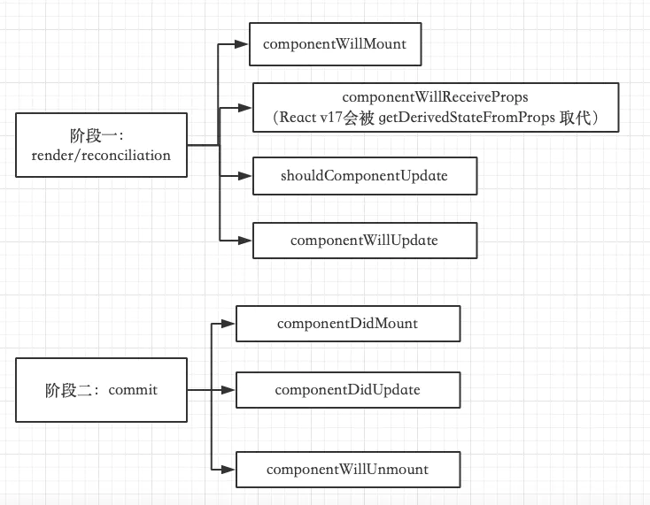
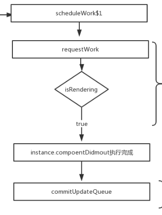

## 先说总结

- setState 只在合成事件和钩子函数中是“异步”的
- setState在原生事件和 setTimeout 中都是同步的。
- 回调式setState(partialState, callback) 的callback能同步拿到更新

**注意：**“异步”打了引号,因为setState的“异步”并不是说内部由异步代码实现，其实本身执行的过程和代码都是同步的，只是合成事件和钩子函数的调用顺序在更新之前，导致在合成事件和钩子函数中没法立马拿到更新后的值，形式了所谓的“异步”

- setState 的批量更新优化也是建立在“异步”（合成事件、钩子函数）之上的，在原生事件和setTimeout 中不会批量更新
- 在“异步”中如果对同一个值进行多次 setState ， setState 的批量更新策略会对其进行覆盖，取最后一次的执行，如果是同时 setState 多个不同的值，在更新时会对其进行合并批量更新。

## setState

我们调用this.setState方法的时候，调用了this.updater.enqueueSetState
```
Component.prototype.setState = function(partialState, callback) {
  this.updater.enqueueSetState(this, partialState, callback, 'setState');
};
```

## this.updater

this.updater 是在哪个地方进行赋值的我们暂时不用关心，只需要知道他被赋值为classComponentUpdater

classComponentUpdater和之前render流程里面的ReactDOM.render中scheduleRootUpdate非常的相似。其实他们就是同一个更新原理
```
const classComponentUpdater = {
  // ......
  enqueueSetState(inst, payload, callback) {
    // inst 就是我们调用this.setState的this，也就是classComponent实例
    // 获取到当前实例上的fiber
    const fiber = ReactInstanceMap.get(inst);
    const currentTime = requestCurrentTime();
    // 计算当前fiber的到期时间（优先级）
    const expirationTime = computeExpirationForFiber(currentTime, fiber);

    // 创建更新一个更新update
    const update = createUpdate(expirationTime);

    //payload是setState传进来的要更新的对象
    update.payload = payload;

    //callback就是setState({},()=>{})的回调函数
    if (callback !== undefined && callback !== null) {
      if (__DEV__) {
        warnOnInvalidCallback(callback, 'setState');
      }
      update.callback = callback;
    }

    // 把更新放到队列UpdateQueue
    enqueueUpdate(fiber, update);

    // 开始进入React异步渲染的核心：React Scheduler
    scheduleWork(fiber, expirationTime);
  },
  // ......
}
```

状态更新都会创建一个保存更新状态相关内容的对象，我们叫他Update。在render阶段的beginWork中会根据Update计算新的state。这里讲这个Update通过enqueueUpdate放到队列UpdateQueue。

## requestWork

scheduleWork里会执行requestWork方法，这和之前讲过的render流程一致

requestWork中可以看到有多个if判断，这里就是setState在不同的场景使用会出现同步和异步的根本原因

```
function requestWork(root, expirationTime) {
  // 将根节点添加到调度任务中
  addRootToSchedule(root, expirationTime)
  
  // isRendering是全局变量，在后面生命周期函数我们会具体分析到
  if (isRendering) {
    return;
  }
  
  // isBatchingUpdates、isUnbatchingUpdates是全局变量
  // react事件时有对他们进行重新赋值
  if (isBatchingUpdates) {
    if (isUnbatchingUpdates) {
      ....
      performWorkOnRoot(root, Sync, false);
    }
    return;
  }
  
  if (expirationTime === Sync) {
    performSyncWork();
  } else {
    scheduleCallbackWithExpirationTime(root, expirationTime);
  }
}

```


## setState不同场景的调用

### 首先是交互事件里的setState

#### 比如在一个点击事件里

React有着一套自己的合成事件机制，在一个事件调用的时候会经过一些处理，这里不详细描述，最重要的一个函数就是interactiveUpdates$1，在执行一个事件的时候会先调用这个函数

```
handleClick(){
    this.setState({
        name: '吴彦祖'
    })
    console.log(this.state.name) // >> 狗蛋
    this.setState({
        age: '18'
    })
    console.log(this.state.age) // >> 40
}

```

#### 了解interactiveUpdates$1方法

注意三个地方：

- isBatchingUpdates = true;让setState不马上更新
- try finally 语句;先执行一个事件里的代码最后才更新
- isBatchingUpdates = previousIsBatchingUpdates;合成事件里setTimeout能马上更新的原因

```
function interactiveUpdates$1(fn, a, b) {
  if (isBatchingInteractiveUpdates) {
    return fn(a, b);
  }

  if (!isBatchingUpdates && !isRendering && lowestPendingInteractiveExpirationTime !== NoWork) {
    // Synchronously flush pending interactive updates.
    performWork(lowestPendingInteractiveExpirationTime, false, null);
    lowestPendingInteractiveExpirationTime = NoWork;
  }
  var previousIsBatchingInteractiveUpdates = isBatchingInteractiveUpdates;
  var previousIsBatchingUpdates = isBatchingUpdates;
  isBatchingInteractiveUpdates = true;
  isBatchingUpdates = true;  // 把requestWork中的isBatchingUpdates标识改为true
  try {
    return fn(a, b);
  } finally {
    isBatchingInteractiveUpdates = previousIsBatchingInteractiveUpdates;
    isBatchingUpdates = previousIsBatchingUpdates;
    if (!isBatchingUpdates && !isRendering) {
      performSyncWork();
    }
  }
}
```

#### 了解isBatchingUpdates变量

interactiveUpdates$1这个方法中把 isBatchingUpdates 设为了 true ,导致在 requestWork 方法中， isBatchingUpdates 为 true ，但是 isUnbatchingUpdates 是 false ，而被直接return了。

```
//requestWork
  if (isBatchingUpdates) {
    if (isUnbatchingUpdates) {
      ....
      performWorkOnRoot(root, Sync, false);
    }
    return;
  }
```

这就导致了requestWork根本没有执行到任何更新的函数，比如performSyncWork，但在最开始的enqueueSetState这个方法里还是已经将每一次更新都存到了一个update队列里。

所以合成事件里的setState不会马上更新，而是存入了一个更新队列里（enqueueUpdate）

#### try finally

interactiveUpdates$1最后执行了一个try finally语法，会先执行 try 代码块中的语句，然后再执行 finally 中的代码，而 fn(a, b) 是在try代码块中执行相关的事件回调，而在finally里才有 performSyncWork(); 也就是说我们写的事件监听函数在try中执行，但更新在finally里，这就导致了所谓的"异步"，state并没有马上更新并渲染到UI上，而是等到事件执行完之后才更新的

```
  try {
    return fn(a, b);
  } finally {
    isBatchingInteractiveUpdates = previousIsBatchingInteractiveUpdates;
    isBatchingUpdates = previousIsBatchingUpdates;
    if (!isBatchingUpdates && !isRendering) {
      performSyncWork();
    }
  }
```

### setTimeout中的setState

你 try 代码块执行到 setTimeout 的时候，这是一个宏任务，把它丢到列队里，并没有去执行，而是先执行的 finally 代码块。

等 finally 执行的时候会执行`isBatchingUpdates = previousIsBatchingUpdates;`将isBatchingUpdates重置为了false 。

导致最后下次事件循环的时候去执行队列里的 setState 时候， requestWork 走的是和原生事件一样的 expirationTime === Sync if分支， 可以同步拿到最新的state值。

```
class App extends Component {

  state = { val: 0 }

 componentDidMount() {
    setTimeout(_ => {
      this.setState({ val: this.state.val + 1 })
      console.log(this.state.val) // 输出更新后的值 --> 1
    }, 0)
 }

  render() {
    return (
      <div>
        {`Counter is: ${this.state.val}`}
      </div>
    )
  }
}

```


### 生命周期函数中的setState

三个全局变量：isRendering、isWorking、isCommitting

- isRendering：开始react更新就为true
- isWorking：进入reconciler阶段就为true、进入commit阶段就为true
- isCommitting：进入commit阶段就为true

render前生命周期属于reconciler阶段：isRendering = true、isWorking = true
Fiber Reconciler 的执行阶段：

- 阶段一是生成 Fiber 树的渐进阶段，可以被打断。
- 阶段二是批量更新节点的阶段，不可被打断。




现在回过头来看requestWork里的第一个if判断
```
function requestWork(){
    ...
    if (isRendering) {
        return
    }
    ...
}
```

和合成事件一样，当 componentDidmount 执行的时候，isRendering为true，react内部并没有更新就先return了，执行完componentDidmount  后才去 commitUpdateQueue 更新。这就导致你在 componentDidmount 中 setState 完去console.log拿的结果还是更新前的值。

```
class App extends Component {

  state = { val: 0 }

 componentDidMount() {
    this.setState({ val: this.state.val + 1 })
   console.log(this.state.val) // 输出的还是更新前的值 --> 0
 }
  render() {
    return (
      <div>
        {`Counter is: ${this.state.val}`}
      </div>
    )
  }
}

```


在componentWillMount中，setState操作，只是把state合并到初始化状态中，而根本不会触发render ；在这里更新state，就等同于直接写在this.state中，所以，在componentWillMount生命周期中的setState根本没有意义

componentWillUnmount 中调用 setState，是不会触发 re-render 的，这是因为所有更新
队列和更新状态都被重置为 null，并清除了公共类，完成了组件卸载操作。

一般情况下，当调用setState后，组件会执行一次更新过程，componentWillReceiveProps等更新阶段的方法会再次被调用，但如果在componentWillReceiveProps中调用setState，并不会额外导致一次新的更新过程，也就是说，当前的更新过程结束后，componentWillReceiveProps等更新阶段的方法不会再被调用一次,不会造成死循环。

shouldComponentUpdate 或者 componentWillUpdate里调用 setState 会再次触发这两个函数，然后在两个函数又触发了 setState，然后再次触发这两个函数。从而死循环


componentDidUpdate的参数prevProps或prevState比较上一次更新的值和现更新的值是否相同处理setState也不会陷入死循环

### 原生事件中的setState

原生事件的调用栈就比较简单了，因为没有走合成事件的那一大堆，直接触发click事件，到 requestWork ,在requestWork里由于 expirationTime === Sync 的原因，直接走了 performSyncWork 去更新，并不像合成事件或钩子函数中被return，所以当你在原生事件中setState后，能同步拿到更新后的state值。

```
class App extends Component {

  state = { val: 0 }

  changeValue = () => {
    this.setState({ val: this.state.val + 1 })
    console.log(this.state.val) // 输出的是更新后的值 --> 1
  }

 componentDidMount() {
    document.body.addEventListener('click', this.changeValue, false)
 }
 
  render() {
    return (
      <div>
        {`Counter is: ${this.state.val}`}
      </div>
    )
  }
}


```

### setState批量更新的情况

我们知道setState在合成事件中不会马上更新，而是等待事件结束的时候更新，如果是多个setState会合并为一个以提升性能。但我们发现setState传入对象的时候和传入一个回调函数时候结果会有所不同，是哪里产生了这种差异呢，下面会通过实例与源码分析，先看实例

#### setState传入对象会合并对象

点击一次就调用两次 setState()，但是，count 每一次却还是只增加了 1
```
class IncrementByObject extends React.Component {
    constructor(props) {
        super(props);
        this.state = {
            count: 0
        };
        this.increment = this.increment.bind(this);
    }
  
    // 此处设置调用三次 setState()
    increment() {
        this.setState({
            count: this.state.count + 1
        });
        
        this.setState({
            count: this.state.count + 1
        });

        this.setState({
            count: this.state.count + 1
        });
    }
  
    render() {
        return (
            <div>
                <button onClick={this.increment}>IncrementByObject</button>
                <span>{this.state.count}</span>
            </div>
        );
    }
}


```

#### setState传入函数

这样点一次就可以增加3
```
 // 此处设置调用两次 setState()
    increment() {
        // 采用传入函数的方式来更新 state
        this.setState((prevState, props) => ({
            count: prevState.count + 1
        }));
        this.setState((prevState, props) => ({
            count: prevState.count + 1
        }));
        this.setState((prevState, props) => ({
            count: prevState.count + 1
        }));
    }

```

#### 看源码分析原因

>详细的源码可以参考我讲React Scheduler那篇，这里只截取部分关键代码，是在scheduleWork后进入workLoop的beginWork里

React加入fiber架构后，最选调度之前通过enqueueUpdate函数维护的UpdateQueue就是挂载在组件对应的fiber节点上，我们更新的通过调度最后会进入到updateClassComponent方法，里面最终会调用一个getStateFromUpdate来获取最终的state状态

getStateFromUpdate函数外面是对UpdateQueue队列的一个while循环，比如我们连续setState三次，那每次都会创建一个update实例通过enqueueUpdate放入fiber的UpdateQueue中，这里就是把这三次的state合并计算出一个最终的值以提高性能

```
 while (update !== null) {
    // ...省略...

    /**
     * resultState作为参数prevState传入getStateFromUpdate，然后getStateFromUpdate会合并生成
     * 新的状态再次赋值给resultState。完成整个循环遍历，resultState即为最终要更新的state。
     */
    resultState = getStateFromUpdate(
      workInProgress,
      queue,
      update,
      resultState,
      props,
      instance,
    );
    // ...省略...

    // 遍历下一个update对象
    update = update.next;
  }
```

getStateFromUpdate 函数主要功能是将存储在更新对象update上的partialState与上一次的prevState进行对象合并，生成一个全新的状态 state。
```
function getStateFromUpdate<State>(
  workInProgress: Fiber,
  queue: UpdateQueue<State>,
  update: Update<State>,
  prevState: State,
  nextProps: any,
  instance: any,
): any {
  switch (update.tag) {

    // ....省略 ....

    // 调用setState会创建update对象，其属性tag当时被标记为UpdateState
    case UpdateState: {
      // payload 存放的是要更新的状态state
      const payload = update.payload;
      let partialState;

      // 获取要更新的状态
      if (typeof payload === 'function') {
        partialState = payload.call(instance, prevState, nextProps);
      } else {
        partialState = payload;
      }

      // partialState 为null 或者 undefined，则视为未操作，返回上次状态
      if (partialState === null || partialState === undefined) {
        return prevState;
      }

      // 注意：此处通过Object.assign生成一个全新的状态state， state的引用地址发生了变化。
      return Object.assign({}, prevState, partialState);
    }

    // .... 省略 ....
  }

  return prevState;
}

```

#### setState传入一个对象

如果是一个Object，直接看最后的Object.assign({}, prevState, partialState);

Object.assign的作用：
主要是将所有可枚举属性的值从一个或多个源对象复制到目标对象，同时返回目标对象。如果目标对象中的属性具有相同的键，则属性将被源对象中的属性覆盖。后来的源对象的属性将类似地覆盖早先的属性。

之前提过在合成事件中或者在生命周期了state是不会马上刷新的，是在事件执行完后也就是try finally的finally里才真正刷新，这就导致了每次Object.assign的partialState都是this.state.count + 1，而state的count在三次setState的时候都不会改变都是0，所以计算过程可以简化如下：

```
Object.assign({}, {count:0}, {count:1});
Object.assign({}, {count:0}, {count:1});
Object.assign({}, {count:0}, {count:1});
```

很明显最终的state的count只会增加1


#### setState传入一个回到函数 

如果是一个回调函数function
可以发现`if (typeof payload === 'function')`这里对传入的是否是方法做了判断，如果是方法，就执行

```
partialState = payload.call(instance, prevState, nextProps);
```
  
instance对于类组件来说，这里保存类组件的实例在外层的 updateClassInstance函数中`const instance = workInProgress.stateNode;`赋值的。workInProgress就是正在构建更新的fiber tree（workInProgress tree）。每个workInProgress tree节点上都有一个effect list用来存放diff结果当前节点更新完毕会向上merge effect list（queue收集diff结果）扯远了这是fiber的内容了我前面的文章详细说明过。

这里其实只看payload和prevState就行了，payload是我们通过setState传入的回调函数，返回最新的state，while循环调用getStateFromUpdate每次传入的是resultState，也就是说接受的state都是上一轮计算之后的新值，因此循环计算的过程可以简化如下：

```
Object.assign({}, {count:0}, {count:1});
Object.assign({}, {count:0}, {count:2});
Object.assign({}, {count:0}, {count:3});
```
可以看到最终的state的count只会增加3，可以满足我们的期望

## setSate更新的Fiber渲染流程

从fiber到root：从触发状态更新的fiber一直向上遍历到rootFiber（调用markUpdateLaneFromFiberToRoot方法。），并返回rootFiber。由于不同更新优先级不尽相同，所以过程中还会更新遍历到的fiber的优先级。

现在我们拥有一个rootFiber，该rootFiber对应的Fiber树中某个Fiber节点包含一个Update。接下来通知Scheduler，调用的方法是ensureRootIsScheduled。

## 总结流程

```
触发状态更新（根据场景调用不同方法）

    |
    |
    v

创建Update对象（批量更新）

    |
    |
    v

从fiber到root（`markUpdateLaneFromFiberToRoot`）

    |
    |
    v

调度更新（`ensureRootIsScheduled`）

    |
    |
    v

render阶段（`performSyncWorkOnRoot` 或 `performConcurrentWorkOnRoot`）

    |
    |
    v

commit阶段（`commitRoot`）
```