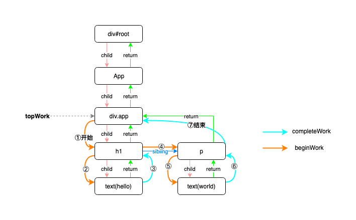
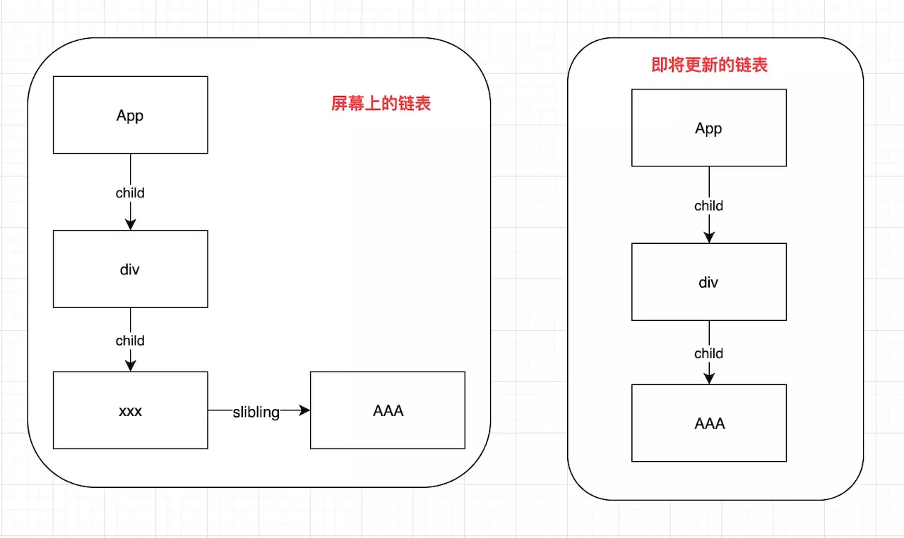

## 在哪里进入的Diff

React加入fiber架构后，最选调度之前通过enqueueUpdate函数维护的UpdateQueue就是挂载在组件对应的fiber节点上，我们更新的通过调度最后会进入到updateClassComponent方法，里面最终会调用一个getStateFromUpdate来获取最终的state状态

workLoop->beginWork->finishClassComponent->reconcileChildren
如何进入beginWork详细的源码可以参考Scheduler任务调度器那篇，beginWork会将一个一个的Fiber来进行diff，期间是可中断的，因为每次执行下一个Fiber的比对时，都会先判断这一帧剩余的时间是否充足。

链表的每一个节点是 Fiber，而不是在 16 之前的虚拟DOM 节点。每一个Fiber 都有
React16 的 diff 策略采用从链表头部开始比较的算法，是链式的深度优先遍历。


## WorkLoop里遍历每个工作单元(Fiber节点)

循环单元更新，对整颗 fiberTree 都遍历一遍。

还记得之前传入进来的isYieldy的么，如果为false，不可中断，不断的更新下一个节点任务（performUnitOfWork(nextUnitOfWork)），知道整棵树更新完毕。如果可以中断，通过shouldYield()判断当前帧是否还有时间更新，有时间就更新，没有时间了就不更了。

```
function workLoop(isYieldy) {
  // 对 nextUnitOfWork 循环进行判断，直到没有 nextUnitOfWork
  if (!isYieldy) {
    // 不可中断
    // Flush work without yielding
    while (nextUnitOfWork !== null) {
      // 一开始进来 nextUnitOfWork 是 root，每次执行 performUnitOfWork 后
      // 都会生成下一个工作单元
      nextUnitOfWork = performUnitOfWork(nextUnitOfWork);
    }
  } else {
    // 可中断
    // Flush asynchronous work until the deadline runs out of time.
    while (nextUnitOfWork !== null && !shouldYield()) {
      nextUnitOfWork = performUnitOfWork(nextUnitOfWork);
    }
  }
}
```


循环寻找工作单元的这个流程其实很简单，就是自顶向下再向上的一个循环。这个循环的规则如下：

- 1.root 永远是第一个工作单元（下图从div.app开始），不管之前有没有被打断过任务
- 2.首先判断当前节点是否存在第一个子节点，存在的话它就是下一个工作单元，并让下一个工作节点继续执行该条规则，不存在的话就跳到规则 3
- 3.判断当前节点是否存在兄弟节点。如果存在兄弟节点，就回到规则 2，否则跳到规则 4
- 4.回到父节点并判断父节点是否存在。如果存在则执行规则 3，否则跳到规则 5
- 5.当前工作单元为 null，即为完成整个循环



- completeWork往上指了后才算一个节点完成比对

## 工作单元(Fiber)的diff方式


不同类型的工作单元diff的方式是不同的，，因为涉及到不同类型组件及 DOM 的处理。这里以最常用的class组件类型为例。

class 组件的调和过程大致分为两个部分：
- 生命周期函数的处理
  - componentWillReceiveProps
- 调和子组件，也就是 diff 算法的过程

一个Class组件一定有一个render函数，并且return的内容会被JSX语法解析成Elements Tree描述UI信息(也可以叫虚拟树),所以我们需要调用 render 函数获取新的 child，用于在之后与老的 child 进行对比。


- returnFiber 是即将 Diff 的这层的父节点。
- currentFirstChild是当前层的第一个 Fiber 节点。
- newChild 是即将更新的 vdom 节点(可能是 TextNode、可能是 ReactElement，可能是数组)，不是 Fiber 节点


## diff过程

第一轮遍历的核心逻辑是复用和当前节点索引一致的老节点，一旦出现不能复用的情况就跳出遍历。

### TextNode的diff
新旧节点都为TextNode(文本节点)，可以直接复用，因为文本节点不需要 key

### React Element的diff
其他类型节点(React Element)满足一下两点才可以复用:
-  key 相同（key 相同，可能类型不同）
-  节点的类型相同
-  满足上面两点节点只是变化了内容，不需要创建新的节点，可以复用的

```
if (child.key === key) {
  if (
    child.tag === Fragment
    ? element.type === REACT_FRAGMENT_TYPE
    : child.elementType === element.type
  ) {
    // 为什么要删除老的节点的兄弟节点？
    // 因为当前节点是只有一个节点，而老的如果是有兄弟节点是要删除的，是多于的。删掉了之后就可以复用老的节点了
    deleteRemainingChildren(returnFiber, child.sibling);
    // 复用当前节点
    const existing = useFiber(
      child,
      element.type === REACT_FRAGMENT_TYPE
      ? element.props.children
      : element.props,
      expirationTime,
    );
    existing.ref = coerceRef(returnFiber, child, element);
    existing.return = returnFiber;
    return existing;
}

```

### Array Diff
>即returnFiber父节点的child有多个,父节点的child指针只指向currentFirstChild，然后通过sibling指针指向兄弟节点

#### 循环遍历数组
```
let newIdx = 0 // 新数组的索引
for (; oldFiber !== null && newIdx < newChildren.length; newIdx++) {
  // 遍历老的节点
  nextOldFiber = oldFiber.sibling; 
  // 返回复用节点的函数，newFiber 就是复用的节点。
  // 如果为空，就代表同位置对比已经不能复用了，循环结束。
  const newFiber = updateSlot(
    returnFiber,
    oldFiber,
    newChildren[newIdx],
    expirationTime,
  );
  
  if (newFiber === null) {
    break;
  }
  
  // 其他 code，比如删除复用的节点
}


```
那么 newFiber 为 null，这个循环就会跳出,结束第一次循环。
当第一轮遍历结束后，会出现两种情况：

- newChild 已经遍历完：当出现 newChild 已经遍历完的情况时只需要把所有剩余的老节点都删除即可。**删除的逻辑也就是设置 effectTag 为 Deletion**，另外还有几个 fiber 节点属性需要提及下。

当出现需要在渲染阶段进行处理的节点时，会把这些节点放入父节点的 effect 链表中，比如需要被删除的节点就会把加入进链表。这个链表的作用是可以帮助我们在渲染阶段迅速找到需要更新的节点。

- 老的节点已经遍历完了：当出现老的节点已经遍历完了的情况时，就会开始第二轮遍历。这轮遍历的逻辑很简单，只需要把剩余新的节点全部创建完毕即可。

```
if (oldFiber === null) {
  // 如果老的节点已经被复用完了，对剩下的新节点进行操作
  for (; newIdx < newChildren.length; newIdx++) {
    const newFiber = createChild(
      returnFiber,
      newChildren[newIdx],
      expirationTime,
    );
  }
  return resultingFirstChild;
}

```


#### Array Diff里相同位置(index)进行比较

因为是一一对比，相当于是一个节点一个节点的对比。和之前只有一个ReactElement 和 TextNode 复用类似

##### TextNode 

如果 key 不为 null，那么就代表老节点不是 TextNode，而新节点又是 TextNode，所以返回 null，不能复用，反之则可以复用，调用 updateTextNode 方法。


##### ReactElement

基本上走的就是上面单个 ReactElement 比对的逻辑了，判断 key 和 元素的类型是否相等来判断是否可以复用。

但是如果旧的第一个节点和新的第三个节点相同怎么办？删了不是可惜了，这时候可以再通过一次遍历通过Key来判断是否需要复用


这种策略就是从 div 下面的所有子节点去找有没有可以复用的节点，而不是像 TextNode 一样，只是找第一个 child 是否可以复用，如果当前节点的 key 不同，就代表肯定不是同一个节点，所以把当前节点删除，然后再去找当前节点的兄弟节点，直到找到 key 相同，并且节点的类型相同，否则就删除所有的子节点。

```
// 找到 key 相同的节点，就会复用当前节点
while (child !== null) {
  if (child.key === key) {
    if (
      child.tag === Fragment
      ? element.type === REACT_FRAGMENT_TYPE
      : child.elementType === element.type
    ) {
      // 复用节点逻辑，省略该部分代码，和上面复用节点的代码相同
      // code ...
      return existing;
    } else {
      deleteRemainingChildren(returnFiber, child);
      break;
    }
  } else {
    // 如果没有可以复用的节点，就把这个节点删除
    deleteChild(returnFiber, child);
  }
  child = child.sibling;
}
```

如果没有找到可以复用的节点，然后就重新创建节点:
```
// 前面的循环已经把该删除的已经删除了，接下来就开始创建新的节点了
if (element.type === REACT_FRAGMENT_TYPE) {
  const created = createFiberFromFragment(
    element.props.children,
    returnFiber.mode,
    expirationTime,
    element.key,
  );
  created.return = returnFiber;
  return created;
} else {
  const created = createFiberFromElement(
    element,
    returnFiber.mode,
    expirationTime,
  );
  created.ref = coerceRef(returnFiber, currentFirstChild, element);
  created.return = returnFiber;
  return created;
}
```


#### 位置不同，移动的情况如何进行节点复用

对于移动的情况，首先要思考，怎么能判断数组是否发生过移动操作呢？
如果给你两个数组，你是否能判断出来数组是否发生过移动。
答案是：老的数组和新的数组里面都有这个元素，而且位置不相同。
从两个数组中找到相同元素(是指可复用的节点)，方法有很多种，来看看 React 是如何高效的找出来的。
把所有老数组元素按 key 或者是 index 放 Map 里，然后遍历新数组，根据新数组的 key 或者 index 快速找到老数组里面是否有可复用的。
```
function mapRemainingChildren(
 returnFiber: Fiber,
 currentFirstChild: Fiber,
): Map<string | number, Fiber> {
  const existingChildren: Map<string | number, Fiber> = new Map();

  let existingChild = currentFirstChild; // currentFirstChild 是老数组链表的第一个元素
  while (existingChild !== null) {
  // 看到这里可能会疑惑怎么在 Map 里面的key 是 fiber 的key 还是 fiber 的 index 呢？
  // 我觉得是根据数据类型，fiber 的key 是字符串，而 index 是数字，这样就能区分了
  // 所以这里是用的 map，而不是对象，如果是对象的key 就不能区分 字符串类型和数字类型了。
    if (existingChild.key !== null) {
      existingChildren.set(existingChild.key, existingChild);
    } else {
      existingChildren.set(existingChild.index, existingChild);
    }
    existingChild = existingChild.sibling;
	}
	return existingChildren;
}
```

这个 mapRemainingChildren 就是将老数组存放到 Map 里面。元素有 key 就 Map 的键就存 key，没有 key 就存 index，key 一定是字符串，index 一定是 number，所以取的时候是能区分的，所以这里用的是 Map，而不是对象，如果是对象，属性是字符串，就没办法区别是 key 还是 index 了。
现在有了这个 Map，剩下的就是循环新数组，找到 Map 里面可以复用的节点，如果找不到就创建，这个逻辑基本上跟 updateSlot 的复用逻辑很像，一个是从老数组链表中获取节点对比，一个是从 Map 里获取节点对比。
```
// 如果前面的算法有复用，那么 newIdx 就不从 0 开始
for (; newIdx < newChildren.length; newIdx++) {
  const newFiber = updateFromMap(
    existingChildren,
    returnFiber,
    newIdx,
    newChildren[newIdx],
    expirationTime,
  );
 // 省略删除 existingChildren 中的元素和添加 Placement 副作用的情况
}
```
到这里新数组遍历完毕，也就是同一层的 Diff 过程完毕

## Diff过程总结（找复用，打补丁）

### child为单节点

单个孩子节点的比对很简单：
- TextNode：直接复用，因为文本节点不需要 key
- React Element的复用：
  -  key 相同（key 相同，可能类型不同）
  -  节点的类型相同

### child为多节点(是数组)

- 第一遍历新数组，新老数组相同 index 进行对比，通过 updateSlot方法找到可以复用的节点，直到找到不可以复用的节点就退出循环。
- 第二遍历完之后，删除剩余的老节点，追加剩余的新节点的过程。如果是新节点已遍历完成，就将剩余的老节点批量删除；如果是老节点遍历完成仍有新节点剩余，则将新节点直接插入。
- 第三遍通过key优化移动的元素：把所有老数组元素按 key 或 index 放 Map 里，然后遍历新数组，插入老数组的元素，这是移动的情况。(避免了那种位置不对判定为删除或者重新创建的情况)

### 无法复用需要修改的打上effectTag

每个FiberNode都维护着一个effectList链表，一个fiber的effect list只包括他children的更新，不包括他本身，保存着reconciliation阶段的结果，每个effectList包括nextEffect、firstEffect、lastEffect三个指针，分别指向下一个待处理的effect fiber，第一个和最后一个待处理的effect fiber。react调用completeUnitOfWork沿workInProgress进行effect list的收集

为节点打上effectTag，构建完整的effectList链表，从叶子节点归并到root fiber节点上。而这些操作的标记，将用于commit阶段更新到真实DOM树.

## 参考
- https://segmentfault.com/a/1190000019918133
- https://yuchengkai.cn/react/2019-08-05.html#%E8%B0%83%E5%92%8C%E7%9A%84%E8%BF%87%E7%A8%8B


