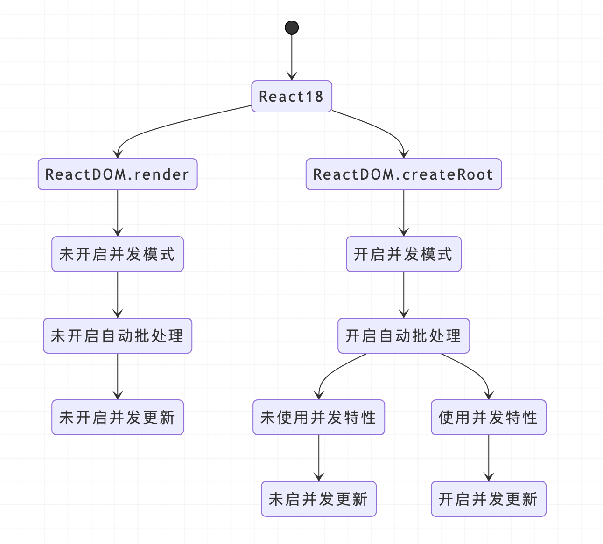

## 兼容性

React 18 已经放弃了对 ie11 的支持，将于 2022年6月15日 停止支持 ie，如需兼容，需要回退到 React 17 版本

## 新的Render API

React 18 引入了一个新的 root API，新的 root API 还支持 new concurrent renderer（并发模式的渲染），它允许你进入concurrent mode（并发模式）。
```ts
// React 17
import React from 'react';
import ReactDOM from 'react-dom';
import App from './App';

const root = document.getElementById('root')!;

ReactDOM.render(<App />, root);

// React 18
import React from 'react';
import ReactDOM from 'react-dom/client';
import App from './App';

const root = document.getElementById('root')!;

ReactDOM.createRoot(root).render(<App />);
```

## setState 自动批处理

在React 18 之前，我们只在 React 事件处理函数 中进行批处理更新。默认情况下，在promise、setTimeout、原生事件处理函数中、或任何其它事件内的更新都不会进行批处理。

在 18 之前，只有在react事件处理函数中，才会自动执行批处理，其它情况会多次更新
在 18 之后，任何情况都会自动执行批处理，多次更新始终合并为一次

## flushSync 强制每次刷新

批处理是一个破坏性改动，如果你想退出批量更新，你可以使用 flushSync：

```ts
import React, { useState } from 'react';
import { flushSync } from 'react-dom';

const App: React.FC = () => {
  const [count1, setCount1] = useState(0);
  const [count2, setCount2] = useState(0);
  return (
    <div
      onClick={() => {
        flushSync(() => {
          setCount1(count => count + 1);
        });
        // 第一次更新
        flushSync(() => {
          setCount2(count => count + 1);
        });
        // 第二次更新
      }}
    >
      <div>count1： {count1}</div>
      <div>count2： {count2}</div>
    </div>
  );
};

export default App;

```
注意：flushSync 函数内部的多个 setState 仍然为批量更新，这样可以精准控制哪些不需要的批量更新。

## Strict Mode 打印两次console

不再抑制控制台日志：
当你使用严格模式时，React 会对每个组件进行两次渲染，以便你观察一些意想不到的结果。在 React 17 中，取消了其中一次渲染的控制台日志，以便让日志更容易阅读。
为了解决社区对这个问题的困惑，在 React 18 中，官方取消了这个限制。如果你安装了React DevTools，第二次渲染的日志信息将显示为灰色，以柔和的方式显式在控制台

## Suspense 不再需要 fallback 来捕获

对于React来说，有两类瓶颈需要解决：

- CPU的瓶颈，如大计算量的操作导致页面卡顿：其中CPU的瓶颈通过并发特性的优先级中断机制解决。

- IO的瓶颈，如请求服务端数据时的等待时间：IO的瓶颈则交给Suspense解决。

在 React 18 的 Suspense 组件中，官方对 空的fallback 属性的处理方式做了改变：不再跳过 缺失值 或 值为null 的 fallback 的 Suspense 边界。相反，会捕获边界并且向外层查找，如果查找不到，将会把 fallback 呈现为 null。

现在，React将使用当前组件的 Suspense 作为边界，即使当前组件的 Suspense 的值为 null 或 undefined：

```ts
// React 18
const App = () => {
  return (
    <Suspense fallback={<Loading />}> // <--- 不使用 (17会使用)
      <Suspense>                      // <--- 这个边界被使用，将 fallback 渲染为 null
        <Page />
      </Suspense>
    </Suspense>
  );
};

export default App;

```

## 流式渲染

### 流式渲染（Streaming HTML）
> 一般来说，流式渲染就是把 HTML 分块通过网络传输，然后客户端收到分块后逐步渲染，提升页面打开时的用户体验。通常是利用HTTP/1.1中的分块传输编码（Chunked transfer encoding）机制。

### React 16 renderToNodeStream
早在 React 16 中同样有一个用于流式传输的 APIrenderToNodeStream来返回一个可读的流（然后就可以将这个流 pipe 给 node.js 的 response 流）给客户端渲染，比原始的renderToString有着更短的 TFFB 时间。TFFB：Time To First Byte，发出页面请求到接收到应答数据第一个字节所花费的毫秒数

```js
app.get("/", (req, res) => {
  res.write(
    "<!DOCTYPE html><html><head><title>Hello World</title></head><body>"
  );
  res.write("<div id='root'>");
  const stream = renderToNodeStream(<App />);
  stream.pipe(res, { end: false });
  stream.on("end", () => {
    // 流结束后再写入剩余的HTML部分
    res.write("</div></body></html>");
    res.end();
  });
});
```
但是renderToNodeStream需要从 DOM 树自顶向下开始渲染，并不能等待某个组件的数据然后渲染其他部分的 HTML

### React 18 renderToPipeableStream
> 具备 Streaming 和 Suspense 的特性，不过在用法上更复杂。

参考官方Demo https://codesandbox.io/s/kind-sammet-j56ro?file=/server/render.js:592-1740

https://juejin.cn/post/7064759195710521381#heading-7

```js
module.exports = function render(url, res) {
  // This is how you would wire it up previously:
  //
  // res.send(
  //   '<!DOCTYPE html>' +
  //   renderToString(
  //     <DataProvider data={data}>
  //       <App assets={assets} />
  //     </DataProvider>,
  //   )
  // );

  // The new wiring is a bit more involved.
  res.socket.on("error", (error) => {
    console.error("Fatal", error);
  });
  let didError = false;
  const data = createServerData();
  const stream = renderToPipeableStream(
    <DataProvider data={data}>
      <App assets={assets} />
    </DataProvider>,
    {
      bootstrapScripts: [assets["main.js"]],
      onShellReady() {
        // If something errored before we started streaming, we set the error code appropriately.
        res.statusCode = didError ? 500 : 200;
        res.setHeader("Content-type", "text/html");
        stream.pipe(res);
      },
      onError(x) {
        didError = true;
        console.error(x);
      }
    }
  );
  // Abandon and switch to client rendering if enough time passes.
  // Try lowering this to see the client recover.
  setTimeout(() => stream.abort(), ABORT_DELAY);
};
```

### 流式 SSR 基于 renderToPipeableStream

SSR 一次页面渲染的流程大概为：

- 服务器 fetch 页面所需数据
- 数据准备好之后，将组件渲染成 string 形式作为 response 返回
- 客户端加载资源
- 客户端合成（hydrate）最终的页面内容

在传统的 SSR 模式中，上述流程是**串行执行**的，如果其中有一步比较慢，都会影响整体的渲染速度。而在 React 18 中，基于全新的 Suspense，支持了流式 SSR，也就是允许服务端一点一点的返回页面。

假设我们有一个页面，包含了 NavBar、Sidebar、Post、Comments 等几个部分，在传统的 SSR 模式下，我们必须请求到 Post 数据，请求到 Comments 数据后，才能返回完整的 HTML。

```html
<Layout>
  <NavBar />
  <Sidebar />
  <RightPane>
    <Post />
    <Suspense fallback={<Spinner />}>
      <Comments />
    </Suspense>
  </RightPane>
</Layout>

=====
<main>
  <nav>
    <!--NavBar -->
    <a href="/">Home</a>
   </nav>
  <aside>
    <!-- Sidebar -->
    <a href="/profile">Profile</a>
  </aside>
  <article>
    <!-- Post -->
    <p>Hello world</p>
  </article>
  <section id="comments-spinner">
    <!-- Spinner -->
    
  </section>
</main>


```
等服务端获取到了 `<Comments>` 的数据后，React再把后加入的 `<Comments>` 的HTML信息，通过同一个流（stream）发送过去,（res.send 替换成 res.socket），React会创建一个超小的内联
```jsx
<div hidden id="comments">
  <!-- Comments -->
  <p>First comment</p>
  <p>Second comment</p>
</div>
<script>
  // This implementation is slightly simplified
  document.getElementById('sections-spinner').replaceChildren(
    document.getElementById('comments')
  );
</script>

```
最后被渲染为

```jsx
<main>
  <nav>
    <!--NavBar -->
    <a href="/">Home</a>
   </nav>
  <aside>
    <!-- Sidebar -->
    <a href="/profile">Profile</a>
  </aside>
  <article>
    <!-- Post -->
    <p>Hello world</p>
  </article>
  <section>
    <!-- Comments -->
    <p>First comment</p>
    <p>Second comment</p>
  </section>
</main>
```

### 选择性注水 （Selective Hydration）
有了lazy和Suspense的支持，另一个特性就是 React SSR 能够尽早对已经就绪的页面部分注水，而不会被其他部分阻塞。从另一个角度看，在 React 18 中注水本身也是 lazy 的。
这样就可以将不需要同步加载的组件选择性地用lazy和Suspense包起来（和客户端渲染时一样）。而 React 注水的粒度取决于Suspense包含的范围，每一层Suspense就是一次注水的“层级”（要么组件都完成注水要么都没完成）。

```js
import { lazy } from "react";

const Comments = lazy(() => import("./Comments.js"));

// ...

<Suspense fallback={<Spinner />}>
  <Comments />
</Suspense>;
```

同样的，流式传输的 HTML 也不会阻塞注水过程。如果 JavaScript 早于 HTML 加载完成，React 就会开始对已完成的 HTML 部分注水。
React 通过维护几个优先队列，能够记录用户的交互点击来优先给对应组件注水，在注水完成后组件就会响应这次交互，即事件重放（event replay）


## 新的API

### useId

支持同一个组件在客户端和服务端生成相同的唯一的 ID，避免 hydration 的不兼容，这解决了在 React 17 及 17 以下版本中已经存在的问题。因为我们的服务器渲染时提供的 HTML 是无序的，useId 的原理就是每个 id 代表该组件在组件树中的层级结构。

```ts
const id = useId();
```

### useSyncExternalStore

useSyncExternalStore 能够通过强制同步更新数据让 React 组件在 CM 下安全地有效地读取外接数据源。 在 Concurrent Mode 下，React 一次渲染会分片执行（以 fiber 为单位），中间可能穿插优先级更高的更新。假如在高优先级的更新中改变了公共数据（比如 redux 中的数据），那之前低优先的渲染必须要重新开始执行，否则就会出现前后状态不一致的情况。
useSyncExternalStore 一般是三方状态管理库使用，我们在日常业务中不需要关注。因为 React 自身的 useState 已经原生的解决的并发特性下的 tear（撕裂）问题。useSyncExternalStore 主要对于框架开发者，比如 redux，它在控制状态时可能并非直接使用的 React 的 state，而是自己在外部维护了一个 store 对象，用发布订阅模式实现了数据更新，脱离了 React 的管理，也就无法依靠 React 自动解决撕裂问题。因此 React 对外提供了这样一个 API。
目前 React-Redux 8.0 已经基于 useSyncExternalStore 实现。

### useInsertionEffect

个 Hooks 只建议 css-in-js 库来使用。 这个 Hooks 执行时机在 DOM 生成之后，useLayoutEffect 之前，它的工作原理大致和 useLayoutEffect 相同，只是此时无法访问 DOM 节点的引用，一般用于提前注入 `<style>` 脚本。

## Concurrent Mode（并发模式）

>并发模式可帮助应用保持响应，并根据用户的设备性能和网速进行适当的调整，该模式通过使渲染可中断来修复阻塞渲染限制。在 Concurrent 模式中，React 可以同时更新多个状态。

React 17 和 React 18 的区别就是：从同步不可中断更新变成了异步可中断更新.

在 React 18 中，提供了新的 root api，我们只需要把 render 升级成 createRoot(root).render(`<App />`) 就可以开启并发模式了

**在 18 中，不再有多种模式，而是以是否使用并发特性作为是否开启并发更新的依据。**

可以从架构角度来概括下，当前一共有两种架构：

- 采用不可中断的递归方式更新的Stack Reconciler（老架构）
- 采用可中断的遍历方式更新的Fiber Reconciler（新架构）

新架构可以选择是否开启并发更新，所以当前市面上所有 React 版本有四种情况：

- 老架构（v15及之前版本）
- 新架构，未开启并发更新，与情况1行为一致（v16、v17 默认属于这种情况）
- 新架构，未开启并发更新，但是启用了并发模式和一些新功能（比如 Automatic Batching，v18 默认属于这种情况）
- 新架构，开启并发模式，开启并发更新

并发特性指开启并发模式后才能使用的特性，比如：

- useDeferredValue
- useTransition

使用这两个API就会进入并发渲染




### useTransition+startTransition

输入框状态改变更新优先级要大于列表的更新的优先级。这个时候我们的主角就登场了。用 startTransition 把两种更新区别开。（如果不加两个更新的优先级是一样的）。

setList 在 startTransition 的回调函数中执行（使用了并发特性），所以 setList 会触发并发更新。

startTransition，主要为了能在大量的任务下也能保持 UI 响应。这个新的 API 可以通过将特定更新标记为“过渡”来显著改善用户交互，简单来说，就是被 startTransition 回调包裹的 setState 触发的渲染被标记为不紧急渲染，这些渲染可能被其他紧急渲染所抢占。
```jsx
import React, { useState, useEffect, useTransition } from 'react';

const App: React.FC = () => {
  const [list, setList] = useState<any[]>([]);
  const [isPending, startTransition] = useTransition();
  const handleChange = () => {
    /* 高优先级任务 —— 改变搜索条件 */
    setInputValue(e.target.value)
    /* 低优先级任务 —— 改变搜索过滤后列表状态  */
    // 使用了并发特性，开启并发更新
    startTransition(() => {
      setList(new Array(10000).fill(null));
    });
  }
  return (
    <>
      <input 
        onChange={handleChange}
        placeholder="输入搜索内容"
        value={value}
      />
      {list.map((_, i) => (
        <div key={i}>{i}</div>
      ))}
    </>
  );
};

export default App;

```

### useDeferredValue

返回一个延迟响应的值，可以让一个**state 延迟生效，只有当前没有紧急更新时，该值才会变为最新值**。useDeferredValue 和 startTransition 一样，都是标记了一次非紧急更新。

从介绍上来看 useDeferredValue 与 useTransition 是否感觉很相似呢？

- 相同：useDeferredValue 本质上和内部实现与 useTransition 一样，都是标记成了延迟更新任务。
- 不同：useTransition 是把更新任务变成了延迟更新任务，而 useDeferredValue 是产生一个新的值，这个值作为延时状态。（一个用来包装方法，一个用来包装值）

所以，上面 startTransition 的例子，我们也可以用 useDeferredValue 来实现：

```tsx
import React, { useState, useEffect, useDeferredValue } from 'react';

const App: React.FC = () => {
  const [list, setList] = useState<any[]>([]);
  useEffect(() => {
    setList(new Array(10000).fill(null));
  }, []);
  // 使用了并发特性，开启并发更新
  const deferredList = useDeferredValue(list);
  return (
    <>
      {deferredList.map((_, i) => (
        <div key={i}>{i}</div>
      ))}
    </>
  );
};

export default App;

```


## 参考
- https://juejin.cn/post/7094037148088664078#heading-18